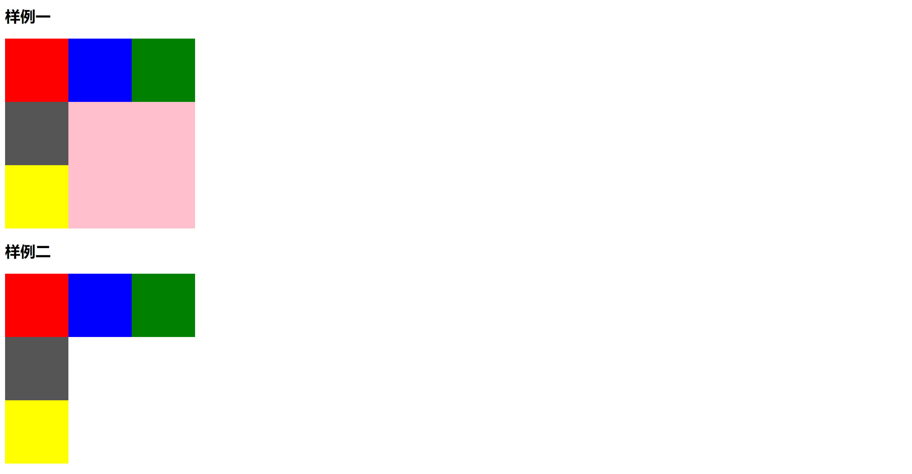

+ [author](https://github.com/3293172751)

# 第15节 网页布局技巧

+ [回到目录](../README.md)
+ [回到项目首页](../../README.md)
+ [上一节](14.md)
> ❤️💕💕HTML和CSS高级教程。更多的文章请移步博客Myblog:[http://nsddd.top](http://nsddd.top/)
---
[TOC]

## 为什么会有这一节

 ⚡我们前面也有浮动和css新特性，但是有些情况还是需要用到网页布局技巧的。

比如说如果你用的是**定位**，那么可能造成后果就是放大后网页乱了。

> 如果没有层与层的折叠，我们尽量不要使用定位。


## 浮动属性`float`

**⚡属性：**

+ `float：left`   元素靠左边浮动
+ `float：right`   元素靠左边浮动
+ `float：none`   元素靠左边浮动


**💡 浮动的作用：**

1. 定义网页中其他文本如何来环绕该元素显示

2. 就是让竖着的东西横着来


## 清除浮动属性`clear`

> 清除浮动属性有三种方式
>
> + 写固定高度 `.container`
> + 清除浮动`clear`
> + 当前浮动元素后面补一个盒子，不设置宽高，`clear:both`

**⚡ 属性：**

+ `Clear：none;`  允许有浮动对象
+ `Clear：right;`  不允许右边有浮动对象
+ `Clear：left;`  不允许左边有浮动对象
+ `Clear：both;`  不允许有浮动对象


**💡 作用：**

改变元素的排列方式，该元素还是漂浮的，不占据文档位置。


###  案例

💡简单的一个案例如下：

```css
<!--
 * @Description: 清除浮动
 * @Author: xiongxinwei 3293172751nss@gmail.com
 * @Date: 2022-10-12 19:51:14
 * @LastEditTime: 2022-10-12 20:05:18
 * @FilePath: \code\7.html
 * @Github_Address: https://github.com/3293172751/cs-awesome-Block_Chain
 * Copyright (c) 2022 by xiongxinwei 3293172751nss@gmail.com, All Rights Reserved. @blog: http://nsddd.top
-->
<!DOCTYPE html>
<html lang="en">
<head>
    <meta charset="UTF-8">
    <meta http-equiv="X-UA-Compatible" content="IE=edge">
    <meta name="viewport" content="width=device-width, initial-scale=1.0">
    <title>01-清浮动</title>
    <style>
        .box1{
            width: 100px;
            height: 100px;
            background-color: red;
            float: left;
        }

        .box2{
            width: 100px;
            height: 100px;
            background-color: blue;
            float: left;
        }

        .box3{
            width: 100px;
            height: 100px;
            background-color: green;
            float: left;
        }

        .box{
            width: 100px;
            height: 100px;
            background-color: yellow;
            float: left;
        }
        .box4{
            width: 100px;
            height: 100px;
            background-color: #555;
            /* 清除浮动 */
            clear: both;
        }

        .container{
            width: 300px;
            height: 300px;
            background-color: pink;
            /* 清除浮动 */
            /* overflow: hidden; */
             clear: both;  /* both是指清除左右浮动 */
        }
    </style>
</head>
<body>
    <h2>样例一</h2>
   <div class="container">
        <div class="box1"></div>
        <div class="box2"></div>
        <div class="box3"></div>
        <div class="box4"></div>
        <div class="box"></div>
   </div>
   <h2>样例二</h2>
   <div>
        <div class="box1"></div>
        <div class="box2"></div>
        <div class="box3"></div>
        <div class="box4"></div>
        <div class="box"></div>
   </div>
</body>
</html>
```

🚀 编译结果如下：




## 基本的框架

> 其实每个css盒子框架模板都是大同小异的，只要我们设置好基本模板，就能胜任大多数工作


**引入基本的html框架**

```html
<!DOCTYPE html>
<html lang="en">
<head>
    <meta charset="UTF-8">
    <meta http-equiv="X-UA-Compatible" content="IE=edge">
    <meta name="viewport" content="width=device-width, initial-scale=1.0">
    <title>Document</title>

    <!-- css样式引入 -->
    <link rel="stylesheet" type="text/css" href="css/index.css">
</head>
<body>
    <!-- 基本html5框架 -->
    <header></header>
    <section></section>
    <footer></footer>
</body>
</html>
```


###  代码

```css
/* 基本的css框架 */
* {
    margin: 0;
    padding: 0;
    box-sizing: border-box;
    /*box-sizing的意思是，如果你设置了一个元素的宽度，那么这个宽度就是这个元素的内容宽度，而不是包括padding和border的宽度*/
}

a {
    text-decoration: none;
    color: #000;
}

ul {
    list-style: none;
}
/* 图片 */
img {
    width: 20%;
    height: 20%;
}

/*header，section,footer*/
header,section,footer {
    width: 100%;
    max-width: 1200px;
    margin: 0 auto;
    /* margin是外边距，auto是自动，意思是让这个元素居中 */
}

/*header,footer*/
header,footer {
    height: 100px;
    background-color: #f00;
}

/*header*/
header {
    display: flex;
    justify-content: space-between;
    align-items: center;
    /* justify-content是水平方向的对齐方式，space-between是两端对齐，align-items是垂直方向的对齐方式，center是居中对齐 */
}

section {
    height: 500px;
    background-color: #0f0;
}

.left {
    width: 200px;
    height: 100%;
    background-color: #00f;
}

.right {
    flex: 1;
    height: 100%;
    background-color: #0ff;
}

footer {
    height: 100px;
    background-color: #f0f;
}

/* 以上是css的基本框架，下面是html的基本框架 */
```


**html**

```html
<!--
 * @Description: 盒子样式
 * @Author: xiongxinwei 3293172751nss@gmail.com
 * @Date: 2022-10-12 20:11:34
 * @LastEditTime: 2022-10-12 20:36:01
 * @FilePath: \code\盒子样式\index.html
 * @Github_Address: https://github.com/3293172751/cs-awesome-Block_Chain
 * Copyright (c) 2022 by xiongxinwei 3293172751nss@gmail.com, All Rights Reserved. @blog: http://nsddd.top
-->
<!DOCTYPE html>
<html lang="en">
<head>
    <meta charset="UTF-8">
    <meta http-equiv="X-UA-Compatible" content="IE=edge">
    <meta name="viewport" content="width=device-width, initial-scale=1.0">
    <title>Document</title>

    <!-- css样式引入 -->
    <link rel="stylesheet" type="text/css" href="css/index.css">
</head>
<body>
    <!-- 基本html5框架 -->
    <header>
        <div class="header">
            <div class="logo">
                
            </div>
            <div class="nav">
                <ul>
                    <li><a href="">首页</a></li>
                    <li><a href="">关于我们</a></li>
                    <li><a href="">产品中心</a></li>
                    <li><a href="">新闻中心</a></li>
                    <li><a href="">联系我们</a></li>
                </ul>
            </div>
        </div>
    </header>

    <section>
        <!-- 盒子框架 -->
        <div class="container">
            <div class="box1"></div>
            <div class="box2"></div>
            <div class="box3"></div>
            <div class="box"></div>
            <div class="box4"></div>
        </div>

        <!-- 盒子框架 -->
        <div>
            <div class="box1"></div>
            <div class="box2"></div>
            <div class="box3"></div>
            <div class="box"></div>
            <div class="box4"></div>
            
    </section>
    <footer>
        <!-- 底部区域盒子框架 -->
        <div class="footer">
            <div class="footer1">
                <div class="footer1_1">
                    <div class="footer1_1_1">
                        
                    </div>
                    <div class="footer1_1_2">
                        <p>公司地址：北京市海淀区中关村大街</p>
                        <p>联系电话：010</p>
                        <p>联系邮箱：3293172751@qq.com</p>
    </footer>
</body>
</html>
```


## END 链接

+ [回到目录](../README.md)
+ [上一节](14.md)
+ [下一节](16.md)
---
+ [参与贡献❤️💕💕](https://github.com/3293172751/CS_COURSE/blob/master/Git/git-contributor.md)
