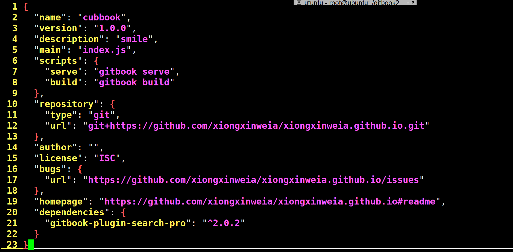
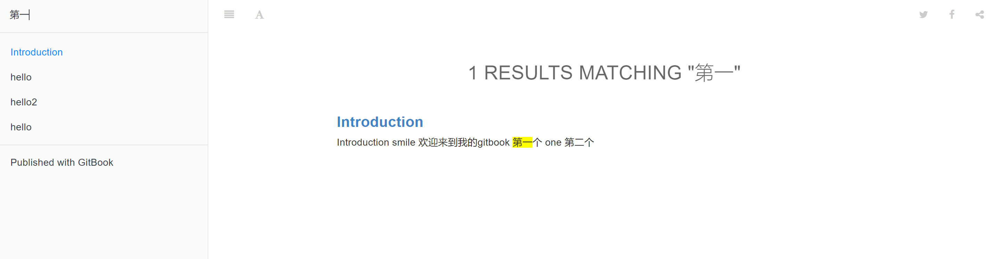
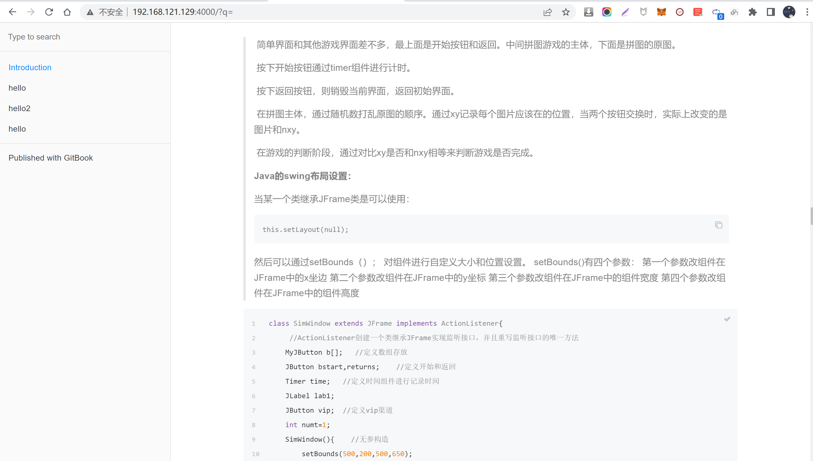

# 安装插件

[toc]

## 安装search-pro插件

```
npm install gitbook-plugin-search-pro
```

**查看插件列表**




**配置book.js**

```
//插件list
plugins: ["-lunr","-search","search-pro"],
```


**我们使用npm来运行**

```
npm run serve
```


**效果**



> 此时有高亮显示


## 安装plug-code插件

```
npm install gitbook-plugin-code
```


**配置插件**

```
//插件list
plugins: ["-lunr","-search","search-pro","code"],
```

> 前缀可以省略，只需要加入后缀就行


## gitbook主题插件

**可以到npm上面搜索，很多热门的主题**

[搜索https://www.npmjs.com/search?q=gitbook-plugin-theme-](https://www.npmjs.com/search?q=gitbook-plugin-theme-)


### 效果

