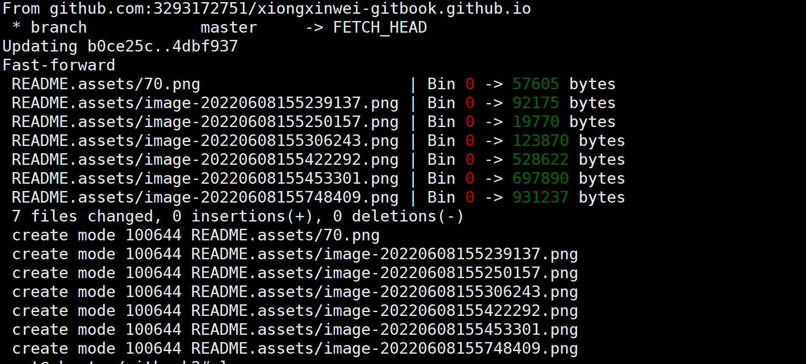

# pages服务

[toc]

创建仓库：Repository name 使用自己的用户名，仓库名规则：

**注意**：`yourname` 必须是你的用户名。


```undefined
xiongxinwei/gitbook.github.io
```


访问 yourname.github.io，如果可以正常访问，那么 Github 的配置已经结束了。

到此搭建 Hexo 博客的相关环境配置已经完成，下面开始讲解 Hexo 的相关操作

**配置密钥**

```
ssh-keygen -t rsa -f ~/.ssh/id_rsa.coding -C “Key for coding.net”
ssh-keygen -t rsa -f ~/.ssh/id_rsa.github -C "github-ub"
```

**`-f`参数目的是起名字**


**此时查看密钥**

```
root@ubuntu:/gitbook2# cd  ~/.ssh/
root@ubuntu:~/.ssh# ls
id_rsa  id_rsa.github  id_rsa.github.pub  id_rsa.pub  known_hosts
```

**上传到github**

```
root@ubuntu:/gitbook2# git remote add origin git@github.com:3293172751/xiongxinwei-gitbook.github.io.git
root@ubuntu:/gitbook2# git push origin master
```


**我们可以同时在gitee上面开启一个仓库**

1. 先拉去代码

   ```
   git remote -v
   ```

   **查看remote组织名称**

2. pull到本地

   ```
   git pull origin master:master
   ```




## 将书籍部署到 gh-pages 分支
这个步骤我使用了 gh-pages 这个工具，它可以将文件夹一键发布到 GitHub 项目下的 gh-pages 分支中（其他分支也可以发布，但是在本文下用到的就是 gh-pages 这个分支）。

首先先安装 gh-pages 工具

```
npm install -g gh-pages
```


然后输入以下指令

```
gh-pages -d _book
```


然后 _book 下的所有文档都会部署到 gh-pages 分支。大功告成。


### 最后效果

