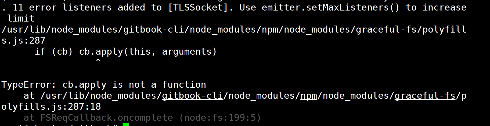
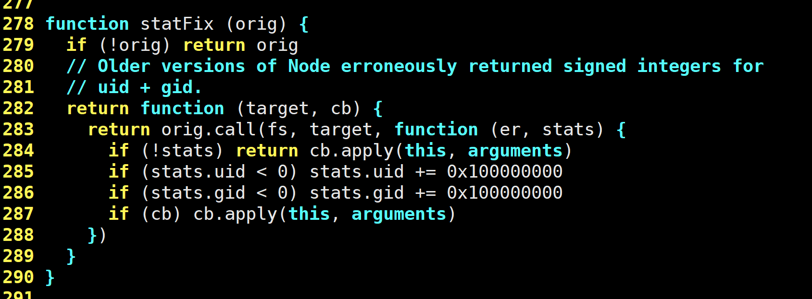
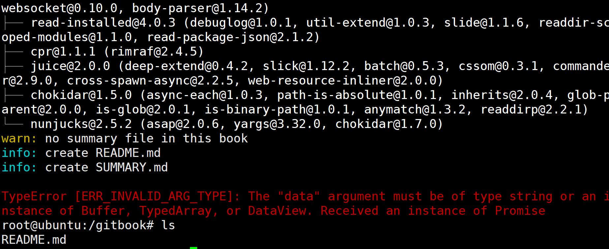

# gitbook init报错分析

[toc]

> 使用gitbook init时，卡在了Installing GitBook 3.2.3这一步解决办法：

**解决办法**：

### 一，翻墙

### 二，使用淘宝镜像下载：

npm下载路径，检查是不是淘宝镜像：

```
npm config get registry
npm config set registry https://registry.npm.taobao.org
```

> 切换成淘宝镜像
> 再检查是不是淘宝镜像：

```
npm config get registry
```

再安装：

```
gitbook init
```


## 新的报错分析



> 不得不服，目测是版本太新了，，，我醉了

```
root@ubuntu:/gitbook# node -v && npm -v
v16.15.0
8.11.0
```

> 产生这个报错的原因在于，nodejs的版本不对，不支持这个gitbook.

### 解决方法

#### 一、切换node.js版本


#### 二、把报错部分注释掉

**直接来到报错部分的代码**



**这个函数的作用是用来修复node.js的一些bug**
**所以，我就找到这个函数的调用：**

**在vim中直接**

```
？statFix
```


**最后再试一下**

```
gitbook init
```


