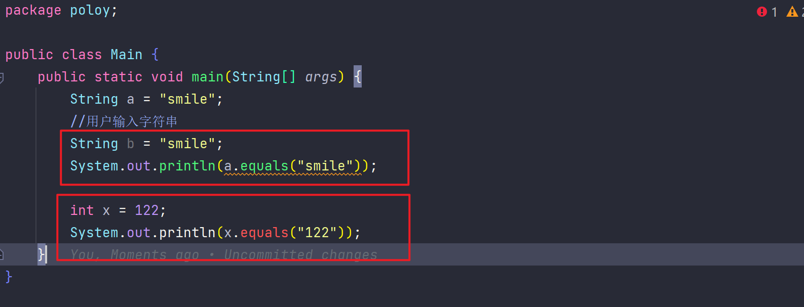
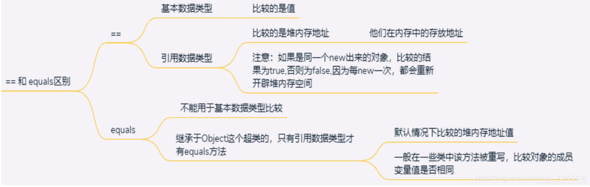

+ [author](https://github.com/3293172751)
+ <a href="https://github.com/3293172751" target="_blank"></a></p>

# 第10节 Java面对对象–下册

+ [回到目录](../README.md)
+ [回到项目首页](../../README.md)
+ [上一节](9.md)
> ❤️💕💕java的学习指南,从入门到大师篇章。Myblog:[http://nsddd.top](http://nsddd.top/)
---
[TOC]

## object类详解

### `toString()`方法

1、`toString()`方法：返回对象的字符串表示，通常是对象的属性值

如：Person [name=张三, age=20, salary=3000.0]，如果没有重写该方法，返回的是对象的内存地址，如：poloy.Person@15db9742

> 默认返回的是`全类名+@+哈希值的十六进制`
>
> **原码：**
>
> + `getClass().getName()`包名+类名
> + `Integer.toHexString(hashCode())`对象的`hashCode`转化为`16进制`
>
> ```java
> public String toString() {
>       return getClass().getName() + "@" + Integer.toHexString(hashCode());
>   }
> ```

**重写`toString`**方法

```java
package Hashcode;

public class ToString {
    public static void main(String[] args) {
        A2 a = new A2();
        System.out.println(a.toString());  // 重写toString()方法后，输出的是对象的地址
        System.out.println(a.hashCode());  // 重写hashCode()方法后，输出的是对象的地址
     }
}

class A2 {
    @Override
    public String toString() {
        return getClass().getName() + "@nsddd.top " + Integer.toHexString(hashCode());
    }
}
```

🚀 编译结果如下：

```
Hashcode.A2@nsddd.top 4eec7777
1324119927
```


### `equals()`方法

2、`equals()`方法：比较两个对象是否相等，如果没有重写该方法，比较的是两个对象的内存地址是否相等，

如：false,如果重写了该方法，比较的是两个对象的属性值是否相等，

> 面试经常问道，是object类方法，**只能判断引用类型（String，包装类）**




### `==` 和 `equals`区别




### `hashCode()`方法

3、`hashCode()`方法：返回对象的哈希码值，如果没有重写该方法，返回的是对象的内存地址的哈希码值。

如：366712642，如果重写了该方法，返回的是对象的属性值的哈希码值，

如：-2128831035

> 小结：
>
> 1. 提高具有哈希结构的容器的效率
> 2. 两个引用，如果指向的是同一个对象，则哈希值肯定是一样的
> 3. 两个引用，如果指向的是不同对象，则哈希值是不一样的
> 4. 两个引用，如果指向的是不同对象，但是哈希值是一样的，这种情况称为哈希冲突
> 5. 哈希值是通过对象的`hashCode()`方法来计算的，如果两个对象的哈希值一样，但是equals()方法返回false，则称为哈希冲突
> 6. 哈希值主要是根据地址号来的，不能完全将哈希值等价于地址

💡简单的一个案例如下：

```java
package Hashcode;

public class HashCode {
    public static void main(String[] args) {
        A a = new A();
        A a2 = new A();   // a2和a是不同的对象
        System.out.println(a.hashCode());  // 重写hashCode()方法后，输出的是对象的地址
        System.out.println(a2.hashCode()); // 重写hashCode()方法后，输出的是对象的地址
        
        A a3 = new A();
        A a4 = a3;  // a3和a4是同一个对象
        System.out.println(a3.hashCode());  // 重写hashCode()方法后，输出的是对象的地址
        System.out.println(a4.hashCode());  // 重写hashCode()方法后，输出的是对象的地址
    }
}

class  A {

}
```

🚀 编译结果如下：

```
1324119927
990368553
1096979270
1096979270
```


### `getClass()`方法

4、`getClass()`方法：返回对象的运行时类，

如：class poloy.Person,如果没有重写该方法，返回的是对象的运行时类，如：class poloy.Person


### `clone()`方法

5、`clone()`方法：

克隆对象，如果没有重写该方法，返回的是对象的内存地址，

如：poloy.Person@6d06d69c，如果重写了该方法，返回的是对象的属性值，如：Person [name=张三, age=20, salary=3000.0]


### `finalize()`方法

6、`finalize()`方法：垃圾回收器在回收对象之前调用该方法，如果没有重写该方法，返回的是对象的内存地址，

如：poloy.Person@7852e922，如果重写了该方法，返回的是对象的属性值，如：Person [name=张三, age=20, salary=3000.0]

💡简单的一个案例如下：

```java
package Hashcode;

public class Car {
    public static void main(String[] args) {
        A3 a3 = new A3("宝马");
        a3 = null;   // a3指向的对象没有引用指向，会被垃圾回收器回收
        //null和0的区别：null是一个引用，0是一个值
        System.gc();  // 手动调用垃圾回收器

        //finalize()方法是在垃圾回收器回收对象之前调用的
        //finalize()方法是Object类中的方法，所有的类都继承了Object类

        System.out.println(a3+"程序结束");
    }
}

class A3 {
    private String name;

    public A3(String name) {
        this.name = name;
    }

    //重写finalize()方法
    @Override
    protected void finalize() throws Throwable {
        System.out.println("垃圾回收器回收了"+name+"对象");
    }
}

```

🚀 编译结果如下：

```
null程序结束
```

**现在object弃用了**

+ 在某个对象没有任何引用时候，jvm认为这个对象是一个垃圾对象，就会使用垃圾回收机制来销毁该对象。销毁之前调用`finalize()`方法

> 后面讲`gvm`的`gc`垃圾回收算法，垃圾回收由系统决定，实际开发几乎用不到。更多为了应付面试。


## java内部类

在 Java 中，也可以嵌套类（类中的类）。嵌套类的目的是将属于一起的类分组，这使您的代码更具可读性和可维护性。

要访问内部类，先创建外部类的对象，然后再创建内部类的对象：

💡简单的一个案例如下：

```java
class OuterClass {
  int x = 10;

  class InnerClass {
    int y = 5;
  }
  class Class2{
  	 int y = 10;
  }
}

public class Main {
  public static void main(String[] args) {
    OuterClass myOuter = new OuterClass();
    OuterClass.InnerClass myInner = myOuter.new InnerClass();
    OuterClass.Class2 myInner2 = myOuter.new Class2();
    System.out.println(myInner.y + myOuter.x);  //15
    System.out.println(myInner2.y + myOuter.x); //20
  }
}
```

------


### public内部

与“常规”类不同，内部类可以是`private`或`protected`。如果您不希望外部对象访问内部类，请将类声明为`private`：

```java
class OuterClass {
  int x = 10;
    
      private class InnerClass {
        int y = 5;
      }  //不能被外部对象访问
}

public class Main {
  public static void main(String[] args) {
    OuterClass myOuter = new OuterClass();
    OuterClass.InnerClass myInner = myOuter.new InnerClass();
    System.out.println(myInner.y + myOuter.x);   //myInner.y ×
  }
}
```

如果您尝试从外部类访问私有内部类，则会发生错误：

```
Main.java:13: error: OuterClass.InnerClass has private access in OuterClass  OuterClass.InnerClass myInner = myOuter.new InnerClass();       ^
```


------

### 静态内部类

内部类也可以是`static`，这意味着您可以在不创建外部类的对象的情况下访问它：

```java
class OuterClass {
  int x = 10;

  static class InnerClass {
    int y = 5;
  }
}

public class Main {
  public static void main(String[] args) {
    OuterClass.InnerClass myInner = new OuterClass.InnerClass();
    System.out.println(myInner.y);
  }
}

// Outputs 5
 
```

**注意：**就像`static`属性和方法一样，`static`内部类不能访问外部类的成员。


## 从内部类访问外部类

内部类的一个优点是它们可以访问外部类的属性和方法：

💡简单的一个案例如下：

```java
class OuterClass {
  int x = 10;

  class InnerClass {
    public int myInnerMethod() {
      return x;
    }
  }
}

public class Main {
  public static void main(String[] args) {
    OuterClass myOuter = new OuterClass();
    OuterClass.InnerClass myInner = myOuter.new InnerClass();
    System.out.println(myInner.myInnerMethod());
  }
}
// Outputs 10
```


## 抽象类和方法

数据**抽象**是隐藏某些细节并仅向用户显示基本信息的过程。
抽象可以通过**抽象类**或 **接口**来实现。

`abstract`关键字是非访问修饰符，用于类和方法 ：

- **抽象类：**是一个受限制的类，不能用于创建对象（要访问它，必须从另一个类继承）。
- **抽象方法：**只能在抽象类中使用，它没有主体。主体由子类（继承自）提供。

抽象类可以同时具有抽象方法和常规方法：

```java
abstract class Animal {
  public abstract void animalSound();
  public void sleep() {
    System.out.println("Zzz");
  }
}
```

从上面的示例中，无法创建 Animal 类的对象：

```java
Animal myObj = new Animal(); //将产生一个错误
```

**要访问抽象类，它必须从另一个类继承。**让我们将我们在[多态](https://www.w3schools.com/java/java_polymorphism.asp)一章中使用的 Animal 类转换为抽象类：

请记住，**在继承中**，我们使用`extends`关键字从类继承。

```java
// Abstract class
abstract class Animal {
  // Abstract method (does not have a body)
  public abstract void animalSound();
  // Regular method
  public void sleep() {
    System.out.println("Zzz");
  }
}

// Subclass (inherit from Animal)
class Pig extends Animal {
  public void animalSound() {
    // The body of animalSound() is provided here
    System.out.println("The pig says: wee wee");
  }
}

class Main {
  public static void main(String[] args) {
    Pig myPig = new Pig(); // Create a Pig object
    myPig.animalSound();
    myPig.sleep();
  }
}
```


### 上转型

```java
// Abstract class
abstract class Animal {
  // Abstract method (does not have a body)
  public abstract void animalSound();
  // Regular method
  public void sleep() {
    System.out.println("Zzz");
  }
}

// Subclass (inherit from Animal)
class Pig extends Animal {
  public void animalSound() {
    // The body of animalSound() is provided here
    System.out.println("The pig says: wee wee");
  }
}

class Main {
  public static void main(String[] args) {
    Pig myPig = new Pig(); // Create a Pig object
    //Animal animal = new Animal(); //不能定义
    //animal.sleep();
    
    Animal myPig2 = new Pig();  //上转型
    myPig.animalSound();
    myPig.sleep();
    myPig2.animalSound();
    myPig2.sleep();
  }
}
```


### 为什么以及何时使用抽象类和方法？

实现安全性 - 隐藏某些细节并仅显示对象的重要细节。

**注意：**抽象也可以通过接口来实现，您将在下一章中了解更多信息。


## 接口

在 Java**中实现抽象的另一种方法是使用接口**。

An`interface`是一个完全“**抽象类**”，用于将相关方法与空主体分组：

```java
// interface
interface Animal {
  public void animalSound(); // interface method (does not have a body)
  public void run(); // interface method (does not have a body)
}
```

要访问接口方法，接口必须由另一个使用`implements` 关键字（而不是）的类“实现”（有点像继承`extends`）。接口方法的主体由“实现”类提供：

```java
// Interface
interface Animal {
  public void animalSound(); // interface method (does not have a body)
  public void sleep(); // interface method (does not have a body)
}

// Pig "implements" the Animal interface
class Pig implements Animal {
  public void animalSound() {
    // The body of animalSound() is provided here
    System.out.println("The pig says: wee wee");
  }
  public void sleep() {
    // The body of sleep() is provided here
    System.out.println("Zzz");
  }
}

class Main {
  public static void main(String[] args) {
    Pig myPig = new Pig();  // Create a Pig object
    myPig.animalSound();
    myPig.sleep();
  }
}
```

### 接口注意事项：

- 与**抽象类**一样，接口**不能**用于创建对象（在上面的示例中，无法在 MyMainClass 中创建“Animal”对象）
- 接口方法没有主体——主体由“实现”类提供
- 在实现接口时，您必须覆盖其所有方法
- 接口方法默认`abstract`是 `public`
- 接口属性是默认的`public`， `static`并且`final`
- 接口不能包含构造函数（因为它不能用于创建对象）

### 为什么以及何时使用接口？

1）为了实现安全——隐藏某些细节，只显示一个对象（接口）的重要细节。

2）Java不支持“多重继承”（一个类只能从一个超类继承）。但是，它可以用接口来实现，因为类可以**实现**多个接口。 **注意：**要实现多个接口，请用逗号分隔它们（参见下面的示例）。

### 接口支持上转型

```java
interface Animal {
  public void animalSound(); // interface method (does not have a body)
  public void sleep(); // interface method (does not have a body)
}

class Pig implements Animal {
  public void animalSound() {
    System.out.println("The pig says: wee wee");
  }
  public void sleep() {
    System.out.println("Zzz");
  }
}

class Main {
  public static void main(String[] args) {
    Pig myPig = new Pig();
    myPig.animalSound();
    myPig.sleep();
    
    Animal myPig2 = new Pig();		//上转型变量
    myPig2.animalSound();
    myPig.sleep();
  }
}
```


------

### 多个接口

要实现多个接口，请用逗号分隔它们：

```java
interface FirstInterface {
  public void myMethod(); // interface method
}

interface SecondInterface {
  public void myOtherMethod(); // interface method
}

class DemoClass implements FirstInterface, SecondInterface {
  public void myMethod() {
    System.out.println("Some text..");
  }
  public void myOtherMethod() {
    System.out.println("Some other text...");
  }
}

class Main {
  public static void main(String[] args) {
    DemoClass myObj = new DemoClass();
    myObj.myMethod();
    myObj.myOtherMethod();
  }
}
```

### 多接口上转型

```java
/*
 * @Description: 
 * @Author: xiongxinwei 3293172751nss@gmail.com
 * @Date: 2022-09-08 14:35:45
 * @LastEditTime: 2022-09-08 14:36:22
 * @FilePath: \code\top.nsddd.erer\src\a\a.java
 * @blog: https://nsddd.top
 */
interface FirstInterface {
  public void myMethod(); // interface method
}

interface SecondInterface {
  public void myOtherMethod(); // interface method
  public void a(int a); 	
}

// DemoClass "implements" FirstInterface and SecondInterface
class DemoClass implements FirstInterface, SecondInterface {
  public void myMethod() {
    System.out.println("Some text..");
  }
  public void myOtherMethod() {
    System.out.println("Some other text...");
  }
  public void a(int a){
  	 System.out.println("A = "+a);
  }  
}

class a {
  public static void main(String[] args) {
    DemoClass myObj = new DemoClass();
    myObj.myMethod();    //Some text..
    myObj.myOtherMethod();   //Some other text...
    
    //上转型
    FirstInterface my1 = new DemoClass();
    my1.myMethod();   //Some text..
    //my1.myOtherMethod();	FirstInterfacec创建的上转型不能用SecondInterface接口方法 
    
    SecondInterface my2 = new DemoClass();
    //my2.myMethod();  SecondInterface创建的上转型不能用 FirstInterfacec接口方法 
    my2.myOtherMethod();  //SecondInterface
    my2.a(1000);  //1000
  }
}
```


## 枚举

An`enum`是一个特殊的“类”，它表示一组 **常量**（不可更改的变量，如`final`变量）。

要创建`enum`，请使用`enum`关键字（而不是类或接口），并用逗号分隔常量。请注意，**它们应该是大写字母**：

```java
enum Level {
  LOW,
  MEDIUM,
  HIGH
}
```

您可以使用**点**语法访问`enum`常量：

```
Level myVar = Level.MEDIUM;
```

**Enum**是“枚举”的缩写，意思是“特别列出”。

------

## 类中的枚举

你也可以`enum`在一个类里面：

```java
public class Main {
  enum Level {
    LOW,
    MEDIUM,
    HIGH
  }

  public static void main(String[] args) {
    Level myVar = Level.MEDIUM; 
    System.out.println(myVar);
  }
}
```

输出将是：

```
MEDIUM
```

------

### Switch 语句中的枚举

枚举经常在`switch`语句中用于检查相应的值：

```java
enum Level {
  LOW,
  MEDIUM,
  HIGH
}

public class Main {
  public static void main(String[] args) {
    Level myVar = Level.MEDIUM;

    switch(myVar) {
      case LOW:
        System.out.println("Low level");
        break;
      case MEDIUM:
         System.out.println("Medium level");
        break;
      case HIGH:
        System.out.println("High level");
        break;
    }
  }
}
```

输出将是：

```
Medium level
```

------

enum 类型有一个`values()`方法，它返回一个包含所有枚举常量的数组。当您想要遍历枚举的常量时，此方法很有用：

```java
enum Level {
  LOW,
  MEDIUM,
  HIGH
}

public class Main { 
  public static void main(String[] args) {
  	  int i = 1;
    for (Level myVar : Level.values()) {
      System.out.println("myVar中的第"+(i++)+"的值为:"+myVar);
    }
  } 
}
```

输出将是：

```
myVar中的第1的值为:LOW
myVar中的第2的值为:MEDIUM
myVar中的第3的值为:HIGH
```


### 枚举和类之间的区别

一个`enum`罐头，就像一个`class`，有属性和方法。唯一的区别是枚举常量是`public`,`static`和`final` (不可更改 - 不能被覆盖)。

An`enum`不能用于创建对象，也不能扩展其他类（但它可以实现接口）。


### 为什么以及何时使用枚举？

当你有你知道不会改变的值时使用枚举，比如月日、日、颜色、卡片组等。


## END 链接

+ [回到目录](../README.md)
+ [上一节](9.md)
+ [下一节](11.md)
---
+ [参与贡献❤️💕💕](https://github.com/3293172751/Block_Chain/blob/master/Git/git-contributor.md)