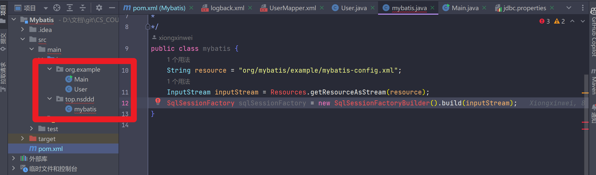
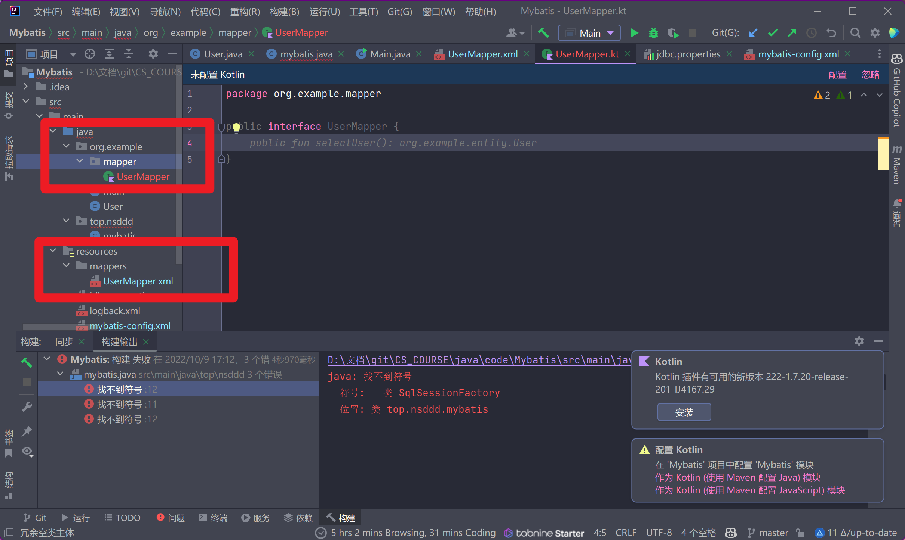

+ [author](https://github.com/3293172751)
+ <a href="https://github.com/3293172751" target="_blank"></a></p>

# 第32节 Mybatis

+ [回到目录](../README.md)
+ [回到项目首页](../../README.md)
+ [上一节](31.md)
> ❤️💕💕java的学习指南,从入门到大师篇章。Myblog:[http://nsddd.top](http://nsddd.top/)
---
[TOC]

## mybits是什么？

+ [x] [官方文档](https://mybatis.org/mybatis-3/zh/index.html)

`Mybits`是一款优秀的持久性框架，用于简化`JDBC`开发

> JDBC缺点：
>
> 1. 硬编码（修改麻烦 – 将代码写死）
>    + 注册驱动，获取链接
>    + sql语句
> 2. 操作繁琐
>    + 手动设置参数
>    + 手动封装结果集

`Javaee`三层架构：

+ 表现层
+ 业务层
+ 持久层


## 框架是什么？

框架是一个半成品软件，是一套可重用的、通用的、软件基础代码模型

在框架基础之上构建软件编写更加高效、规范、通用、可扩展

> 就是用少量的工作实现一个复杂的业务
>
> `mybatis`免除了几乎所有的`JDBC`代码以及设置参数和获取结果集的工作。


## mybabis快速入门

```mysql
create database mybatis;
use mybatis;

drop table if exists tb_user;
# 如果这个 tb_user 表存在，就删除这个表

create table tb_user (
    id int primary key auto_increment,
  	username varchar(20),
    password varchar(20),
    gender char(1),
    addr varchar(30)
);
```

**添加字段：**

```mysql
insert into tb_user values (1, 'zhangsan','123' , '男', '北京');
insert into tb_user values (2, "李四", '234', '女', '天津');
insert into tb_user values (3, "王五", '11', '女', '西安'),(4, "熊某人", '20', '男', '武汉');
```

**查询：**


## 入门

### 安装mybatis

要使用 MyBatis， 只需将 [mybatis-x.x.x.jar](https://github.com/mybatis/mybatis-3/releases) 文件置于类路径（classpath）中即可。

如果使用 Maven 来构建项目，则需将下面的依赖代码置于 pom.xml 文件中：

```xml
<dependency>
  <groupId>org.mybatis</groupId>
  <artifactId>mybatis</artifactId>
  <version>x.x.x</version>
</dependency>
```


## 添加依赖

```xml
<dependencies>
    <!-- mybatis核心包 -->
    <dependency>
        <groupId>org.mybatis</groupId>
        <artifactId>mybatis</artifactId>
        <version>3.5.1</version>
    </dependency>
    <!-- mysql驱动包 -->
    <dependency>
        <groupId>mysql</groupId>
        <artifactId>mysql-connector-java</artifactId>
        <version>8.0.13</version>
    </dependency>
    <!-- junit测试 -->
    <dependency>
        <groupId>junit</groupId>
        <artifactId>junit</artifactId>
        <version>4.11</version>
    </dependency>
</dependencies>
```


## 在resources目录下面创建文件

> （名称不固定），该文件是 Mybatis 核心配置文件，配置文件内容为数据源、事务管理。


**mybatis-config文件**

> 习惯上是这么命名的，并非强制要求的，整合`spring`后这个配置文件可以忽略掉，所以操作的时候直接复制、粘贴。
>
> 存放的地方在`resources/mybatis-config`

```xml
<?xml version="1.0" encoding="UTF-8" ?> <!--声明-->
<!DOCTYPE configuration   <!--configuration主标签，和mappers标签-->
        PUBLIC "-//mybatis.org//DTD Config 3.0//EN"
        "http://mybatis.org/dtd/mybatis-3-config.dtd">
<!--dtd是约束-->
<configuration>
    <!-- 引用 jdbc.properties 配置文件 -->
    <properties resource="jdbc.properties"/>

    <!-- typeAliases 设置类型别名 -->
    <typeAliases>
        <typeAlias alias="User" type="org.example.User"/>
   </typeAliases>

    <!-- environments 环境配置 -->
    <environments default="development">
        <environment id="development">
            <!-- 使用jdbc事务管理 以jdbc来处理的-->
            <transactionManager type="JDBC"/>
            <!-- 数据库连接池 -->
            <!-- 数据库连接相关配置 ,这里动态获取jdbc.properties文件中的内容-->
            <dataSource type="POOLED">
                <property name="driver" value="com.mysql.jdbc.Driver"/>
                <property name="url" value="jdbc:mysql://localhost:3306"/>
                <property name="username" value="root"/>
                <property name="password" value="$123456"/>
            </dataSource>
        </environment>
    </environments>

    <!-- 加载 mapper 映射文件 -->
    <mappers>
        <mapper resource="UserMapper.xml"/>
    </mappers>
</configuration>
```

> 创建映射文件，注意创建映射文件后一定要引入到`mappers`中


**引用 jdbc.properties 文件**，读取配置文件中的属性

> 在 resource 文件夹新建 jdbc.properties 配置文件，保存配置相关的信息。
>
> `JDBC` 连接 `MySQL5` 使用驱动包 `com.mysql.jdbc.Driver`，`JDBC` 连接 `MySQL6` 及以上使用驱动包 `com.mysql.cj.jdbc.Driver`，且需要指定时区 `serverTimezone`。

```mysql
# mysql驱动包名
driver=com.mysql.cj.jdbc.Driver
# 数据库连接地址
url=jdbc:mysql://localhost:3306/demo_1? serverTimezone=GMT &useUnicode=true& characterEncoding=utf8
# 用户名
username=root
# 密码
password=123456
```


**typeAliases 设置类型别名**

类型别名是为 Java 类设置一个短的名字（大小写不敏感），用来减少类完全限定名的冗余。

```xml
<typeAliases>
    <typeAlias alias="User" type="com.noteligible.pojo.User"/>
</typeAliases>
```

但一般来说pojo都会有很多， 所以 `mybatis` 支持指定包名，批量指定别名，扫描整个包下的类。

```xml
<typeAliases>
    <package name="com.noteligible.pojo"/>
    <!-- 其他包 -->
</typeAliases>
```


**environments 环境配置**

> environments 对应的是数据库相关的属性。我们可以配置多个环境，但每个 SqlSessionFactory 实例只能选择其一，和spring整合后 environments配置将废除。


**加载 mappers 映射文件**

> 加载sql的映射文件 — 对应的文件 – 看官网

**新建文件`UserMapper.xml`**   ：`User`是我的表名称

```xml
<?xml version="1.0" encoding="UTF-8" ?>
<!DOCTYPE mapper
        PUBLIC "-//mybatis.org//DTD Mapper 3.0//EN"
        "https://mybatis.org/dtd/mybatis-3-mapper.dtd">
<!--
    namespca: 命名空间  后面会详细讲
    id: sql的唯一标识  不能重复
    parameterType: 参数类型
    resultType: 返回值类型， 对应的是包路径  org.example.User
-->
<mapper namespace="org.mybatis.example.BlogMapper">
    <select id="selectall" resultType="org.example.User">
        select * from tb_user;
    </select>
</mapper>
```


方法一：使用相对于类路径加载单个映射文件

```html
<mappers>
    <mapper resource="com/noteligible/mapper/UserMapper.xml"/>
</mappers>
```


方法二：使用`mapper`接口类路径加载单个映射文件

（此方法要求`mapper`接口名称和`mapper`映射文件名称相同，且放在同一个目录中）

```xml
<mappers>
    <mapper class="com.noteligible.mapper.UserMapper"/>
</mappers>
```


方法三：指定包名批量加载映射文件 ，该配置会扫描指定包中的所有 `.xml` 文件。

（此方法要求`mapper`接口名称和`mapper`映射文件名称相同，且放在同一个目录中）

```xml
<mappers>
    <package name="com.noteligible.mapper"/>
</mappers>
```


## 编写程序



**新建`User`类**

```java
package org.example;

public class User {
    private Integer id;
    private String username;
    private String password;
    private String gender;

    private String addr;

    public User(Integer id, String username, String password, String gender, String addr) {
        this.id = id;
        this.username = username;
        this.password = password;
        this.gender = gender;
        this.addr = addr;
    }

    public Integer getId() {
        return id;
    }

    public void setId(Integer id) {
        this.id = id;
    }

    public String getUsername() {
        return username;
    }

    public void setUsername(String username) {
        this.username = username;
    }

    public String getPassword() {
        return password;
    }

    public void setPassword(String password) {
        this.password = password;
    }

    public String getGender() {
        return gender;
    }

    public void setGender(String gender) {
        this.gender = gender;
    }

    public String getAddr() {
        return addr;
    }

    public void setAddr(String addr) {
        this.addr = addr;
    }

    @Override
    public String toString() {
        return "User{" +
                "id=" + id +
                ", username='" + username + '\'' +
                ", password='" + password + '\'' +
                ", gender='" + gender + '\'' +
                ", addr='" + addr + '\'' +
                '}';
    }
}
```


### 创建测试类

**将下面的内容粘贴到测试文件`top.nsddd.Mybatis`**

```java
String resource = "org/mybatis/example/mybatis-config.xml";
InputStream inputStream = Resources.getResourceAsStream(resource);
SqlSessionFactory sqlSessionFactory = new SqlSessionFactoryBuilder().build(inputStream);
```

`Mybatis`

```java
package top.nsddd;
/*
* mybatis入门代码
*/
public class mybatis {
    String resource = "mybatis-config.xml";
    InputStream inputStream = Resources.getResourceAsStream(resource);
    SqlSessionFactory sqlSessionFactory = new SqlSessionFactoryBuilder().build(inputStream);
}
```


## mybatis映射文件

**相关概念：ORM – 关系对象映射**

+ 对象： Java实体类对象
+ 关系：关系型数据库
+ 映射：两者之间的关系


### 命名规则

1. `mybatis`中支持面对接口的数据操作，要保证两个一致：
   1. `a > mapper`接口的全类名和映射文件的命名空间（`namespace`）保持一致
   2. `b > mapper`接口的方法的方法名和映射文件中编写的SQL的标签的`id`属性保持一致
2. 表名称所对应的`实体类的类名 + Mapper.xml`




## 添加Java映射文件


## END 链接

+ [回到目录](../README.md)
+ [上一节](31.md)
+ [下一节](33.md)
---
+ [参与贡献❤️💕💕](https://github.com/3293172751/Block_Chain/blob/master/Git/git-contributor.md)