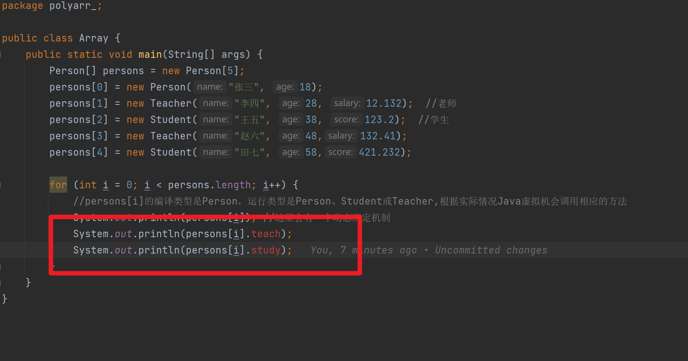

+ [author](https://github.com/3293172751)
+ <a href="https://github.com/3293172751" target="_blank"></a></p>

# 第9节 java面对对象—中册

+ [回到目录](../README.md)
+ [回到项目首页](../../README.md)
+ [上一节](8.md)
> ❤️💕💕java的学习指南,从入门到大师篇章。Myblog:[http://nsddd.top](http://nsddd.top/)
---
[TOC]

## super关键字

 ⚡ `super`代表父类的引用，用于访问父类属性、方法和构造器


### super和this的比较

| No.  | 区别点     | `this`                                                       | `super`                                        |
| ---- | ---------- | ------------------------------------------------------------ | ---------------------------------------------- |
| 1    | 访问属性   | `this`访问的是本类属性，如果本类没有该属性，就从**父类继续查找** | `super`是从**父类开始查找该属性**              |
| 2    | 调用方法   | `this`访问的是本类方法，如果本类没有该方法，就从**父类继续查找** | `super`是从**父类开始查找该方法**              |
| 3    | 调用构造器 | `this`调用的是本类的构造器，必须放在构造器首部               | `this`调用的是本类的构造器，必须放在构造器首部 |
| 4    | 特殊       | 表示当前的对象                                               | 子类中访问父类对象                             |

📜 对上面的解释：

> `this` 和 `super`在调用构造器的时候都必须要放在构造器中的第一行，这一点我们上一节讲到了，所以说，调用构造器 `super` 和 `this`，鱼和熊掌不可兼得。


## java中的访问权限

Java中一共定义四种访问控制权限，由小到大的顺序是：`private<defult<protected<public`。这四种特点如下：

| 序号 | 范围             | private | default | protected | public |
| :--- | :--------------- | :------ | :------ | :-------- | :----- |
| 1    | 同一包中的同一类 | √       | √       | √         | √      |
| 2    | 同一包中的不同类 |         | √       | √         | √      |
| 3    | 不同包的子类     |         |         | √         | √      |
| 4    | 不同包的非子类   |         |         |           | √      |

除了public，其他的都属于封装，但是真正来讲，开发中会使用的封装只有：`private`、`protected`

## 方法重写

⚠️方法重写也叫做方法的覆盖，需要满足下面的条件：

1. **子类的方法的参数，方法名称，要和父类方法的参数，方法名称完全一样**，不然会报错
2. **子类的返回类型和父类的返回类型一样，或者子类返回类型是父类的返回类型的子类**
3. **子类方法不能缩小父类方法的权限**

📜 对上面的解释：

> 对于第二点：比如说子类的返回类型是`object`，我们都知道`object`是所有类的父类，所以是最大的，`object`类是包含了数组和字符串(`string`)
>
> ```java
> public object getInfo(){
> 	//父类的方法
> }
> public String getInfo(){
>     //子类的方法
> }
> ```
>
> 对于第三点：子类是不可以缩小父类方法的访问权限，但是可以扩大
>
> ```java
> void sayOk(){
> 	//父类是默认类
> }
> 
> public void sayOk(){
>     //子类可以扩大访问权限
> }
> 
> private void sayOk(){
>     //子类不可以缩小权限 ×××××××××
> }
> ```


### 方法重写和重载比较

| 名称            | 范围   | 方法名   | 形参列表                       | 返回类型                                 | 修饰符                   |
| --------------- | ------ | -------- | ------------------------------ | ---------------------------------------- | ------------------------ |
| 重载（overload) | 本类   | 必须一样 | 类型、个数或者循序至少一个不同 | 无要求                                   | 无要求                   |
| 重写（override) | 父子类 | 必须一样 | 必须一样                       | 一样或者子类返回类型是父类的返回类型子类 | 子类不能缩小父类的范围， |

> idea中重写的快捷键：
>
> 按 `Ctrl+O` (代码 | 重写方法 )，可以轻松重写基类的方法。
> 要实现当前类实现的接口(或抽象基类)的方法，请按 `Ctrl+I` (代码 | 实现方法)。


## Java多态

>  ⚠️ 多态我觉得是Java学习的过程中最重要也是最难的一部分，在Go语言中也是不存在多态

### 多态的引出

💡简单的一个案例如下：

+ 编写一个程序，Main类中有一个feed(喂事)的方法，可以完成主任给动物喂食

#### 主人类

```java
package ppoly;

/**
 * Main是master主人类
 */
public class Main {
    private  String name;

    public Main(String name) {
        this.name  =  name;
    }

    public String getName() {
        return name;
    }

    public void setName(String name) {
        this.name = name;
    }

    //主任给小狗喂食物 bone
    public void feed(Dog dog,Bone bone) {
        System.out.println("主人 " + name + "给" + dog.getName()+"吃"+bone.getName());
    }

    /*主任给小猫喂黄花鱼*/
    public void feed(Cat cat,Fish fish) {
        /*构成方法的重载*/
        System.out.println("主人 " + name + "给" + cat.getName()+"吃"+fish.getName());
    }
 }

```


#### Food类食物类

```java
package ppoly;

public class Food {
    private String name;

    public Food(String name) {
        this.name = name;
    }

    public String getName() {
        return name;
    }

    public void setName(String name) {
        this.name = name;
    }
}

```


**骨头🦴：**

```java
public class Bone extends Food {

    public Bone(String name) {
        super(name);
    }
}
```


**鱼🐟：**

```java
package ppoly;

public class Fish extends Food {

    public Fish(String name) {
        /*调用父类的无参构造器*/
        super(name);
    }
}
```


#### Animal动物类

```java
package ppoly;

public class Animal {
    public String name;


    public Animal(String name) {
        this.name = name;
    }

    public String getName() {
        return name;
    }

    public void setName(String name) {
        this.name = name;
    }
}

```


**猫🐱：**

```java
package ppoly;

public class Cat extends Animal {
    public Cat(String name) {
        super(name);
    }
}
```


**狗🐕：**

```java
package ppoly;

public class Dog extends Animal {
    public Dog(String name) {
        super(name);
    }
}
```


#### 测试类

```java
package ppoly;

class Text {
    /*测试类*/
    public static void main(String[] args) {
        Main zhangsan = new Main("张三");  //创建主任类
        System.out.println("主任给小狗喂食物");
        Dog dog = new Dog("大黄");    //创建狗类
        Bone bone = new Bone("大棒骨\n");
        zhangsan.feed(dog,bone);

        System.out.println("主人给小猫喂食物");
        /*创建小猫*/
        Cat cat = new Cat("小花猫");
        Fish fish = new Fish("武昌鱼\n");
        zhangsan.feed(cat,fish);
    }
}
```


🚀 编译结果如下：

```bash
主任给小狗喂食物
主人 张三给大黄吃大棒骨

主人给小猫喂食物
主人 张三给小花猫吃武昌鱼
```


📜 对上面的解释：

> 我们可以看到如果主人的动物很多，食物很多，那么就会出现问题：feed方法很多，不利于管理和维护。但是上面很多的本质：
>
> 我们需要提高代码的复用性，那么此时**多态**就要登场了。


### 方法重载体现多态

 ⚠️我们传入不同的参数可以调用不同的方法：

```java
public void feed(Dog dog,Bone bone) {
    System.out.println("主人"+name+"给"+dog.getName()+"吃"+bone.getName());
}

/*主任给小猫喂黄花鱼*/
public void feed(Cat cat,Fish fish) {
    /*构成方法的重载*/
    System.out.println("主人"+name+"给"+cat.getName()+"吃"+fish.getName());
}
```

> 同样还有重写体现多态


### 对象体现多态

⚠️ 很重要的几句话：

+ **一个对象的编译类型和运行类型可以不一致**

  下面就是`animal`的编译类型是`Animal`，但是运行类型是`Dog`

  ```
  Animal animal = new Dog();
  ```

+ **编译看左，运行看右（等号左边，等号右边）**

+ **编译类型在定义对象的时候，就确定了，不可以改变**

+ **运行类型是可以变化的！！！**


📜 对上面的解释：

> 编译类型和运行类型不一样这是多态的体现，同样，运行类型可以变化更是多态的体现。


💡简单的一个案例如下：

```java
package ppoly.object;

class Animal {
    public void cry() {
        System.out.println("Animal 里面的 动物在叫");
    }
}

class Dog extends Animal {
    /*也是重写父类cry*/

    @Override
    public void cry() {
        System.out.println("Dog cty() 小狗再叫");
    }
}

class Cat extends Animal {
    /*重写cry()方法*/
    @Override
    public void cry() {
        System.out.println("Cat cry() 方法 小猫叫");
    }
}


public class PolyObject {
    public static void main(String[] args) {
        /*多态的特点：*/
        Animal animal = new Dog();  //编译类型Animal，运行类型是Dog
        animal.cry();   //因为运行类型是Dog，所以运行到此时，cay是Dog的cry -- Dog cty() 小狗再叫

        //运行类型变化一下,此时运行类型变化成为Cat
        animal = new Cat();
        animal.cry();   //运行类型变了 --- Cat cry() 方法 小猫叫

        //再发生变化
        animal = new Animal();
        animal.cry();   //运行类型又变了 --- Animal 里面的 动物在叫
    }
}
```

🚀 编译结果如下：

```java
Dog cty() 小狗再叫
Cat cry() 方法 小猫叫
Animal 里面的 动物在叫
```


📜 对上面的解释：

> 可以看到一个父类的对象引用是可以指向子类的对象，而且以运行类型为主，那么我们现在也可以对上面主人喂食进行多态改进了。


### 多态入门–解决主人喂食问题

**对main改进：**

```java
public void feed(Dog dog,Bone bone) {
    System.out.println("主人"+name+"给"+dog.getName()+"吃"+bone.getName());
}

/*主任给小猫喂黄花鱼*/
public void feed(Cat cat,Fish fish) {
    /*构成方法的重载*/
    System.out.println("主人"+name+"给"+cat.getName()+"吃"+fish.getName());
}
```


**改进后：**

```java
/*使用多态机制，统一管理主人喂食物问题*/
public void feed(Animal animal,Food food) {
    //直接用父类来管理
    System.out.println(name+"给"+ animal.getName()+"吃"+food.getName());
}
```

> `animal` 编译类型是`Animal`，可以指向（接收）`Animal`子类对象
>
> `food`编译类型是`Food`，可以指向（接收）`Food`子类对象


**我们后面再添加类就可以直接添加了：**

添加动物`big`🐷：

```java
package ppoly;

public class Pig extends Animal {
    public Pig(String name) {
        super(name);
    }
}
```


添加食物`rice`🍚：

```java
package ppoly;

public class Rice extends Food {
    public Rice(String name) {
        super(name);
    }
}
```


测试类：

```java
package ppoly;

class Text {
    /*测试类*/
    public static void main(String[] args) {
        Main zhangsan = new Main("张三");  //创建主人类
        System.out.println("给小猪喂米饭");
        Pig pig = new Pig("小花猪");
        Rice rice = new Rice("主人吃剩下的米饭");
        zhangsan.feed(pig,rice);
    }
}
```


🚀 编译结果如下：

```
给小猪喂米饭
主人 张三给小花猪吃主人吃剩下的米饭
```


### 多态的基本介绍

> 多态的前提：两个（对象）类存在继承关系，所以多态基于封装和继承。

多态意味着“多种形式”，当我们有许多通过继承相互关联的类时就会发生这种情况。

就像我们在上面继承中中指定的那样； 

+ **继承**让我们从另一个类继承属性和方法。
+ **多态性** 使用这些方法来执行不同的任务。这使我们能够以不同的方式执行单个操作。

```java
class Animal {
  public void animalSound() {
    System.out.println("The animal makes a sound");
  }
}

class Pig extends Animal {
  public void animalSound() {
    System.out.println("The pig says: wee wee");
  }
}

class Dog extends Animal {
  public void animalSound() {
    System.out.println("The dog says: bow wow");
  }
}
```

请记住，在继承中，我们使用`extends`关键字从类继承。

现在我们可以创建`Pig`和` Dog`对象并调用`animalSound()`它们的方法：


💡简单的一个案例如下：

```java
class Animal {   //父类 -- 两个子类
  public void animalSound() {
    System.out.println("The animal makes a sound");
  }
}

class Pig extends Animal {
  public void animalSound() {
    System.out.println("The pig says: wee wee");
  }
}

class Dog extends Animal {
  public void animalSound() {
    System.out.println("The dog says: bow wow");
  }
}

class Main {
  public static void main(String[] args) {
    Animal myAnimal = new Animal();  // Create a Animal object
    Animal myPig = new Pig();  // Create a Pig object
    Animal myDog = new Dog();  // Create a Dog object
    myAnimal.animalSound();
    myPig.animalSound();
    myDog.animalSound();
  }
}
```

🚀 编译结果如下：

```
The animal makes a sound
The pig says: wee wee
The dog says: bow wow
```


## 上转型对象

⚠️ 上转型对象有非常多的细节，下面的代码就可以体现出来，我把细节都隐藏在里面（注释）

```java
package Poly2;

public class Main {
    public static void main(String[] args) {
        Animal animal = new Animal();
        Animal obj = new Obj();
        Animal cat = new Cat();
        animal.animal01();
        obj.animal01();  //可以调用，自己的方法
        //obj.obj01();  注意不能调用，因为编译类型是Animal,定义的一瞬间确定了，所以它的方法没有后面的
        cat.animal01();
        //cat.cat01();

        Cat cat2 = new Cat();
        cat2.animal01();
        cat2.cat01();
        cat2.obj01();   //可以调用，而且cat往上找

        //能往上找多少？  -- 自己--> 往上给我趴
        cat2.show();

        Obj obj2 = new Cat();  //注意这个时候能找出来的是自己的Obj对象方法
        obj2.animal01();
        obj2.obj01();
        //obj2,cat2(); 不可以，编译类型确定后没有这个对象
        obj2.show();

    }
}

class Animal {
    String name = "animal";
    public  void animal01(){
        System.out.println("Animal的animal01方法");
    }
    public void show() {
        System.out.println("姓名是："+name+"\n");
    }
}

class Obj extends Animal {
    String name = "obj";
    public void obj01(){
        System.out.println("Obj的obj01方法");
    }
    public void show() {
        System.out.println("姓名是："+name+"\n");
    }
}

class  Cat extends Obj {
    String name = "cat";
    public void cat01(){
        System.out.println("Cat01方法");
    }
    public void show() {
        System.out.println("姓名是："+name+"\n");
    }
}
```

🚀 编译结果如下：

```bash
Animal的animal01方法
Animal的animal01方法
Animal的animal01方法
Animal的animal01方法
Cat01方法
Obj的obj01方法
姓名是：cat

Animal的animal01方法
Obj的obj01方法
姓名是：cat
```


📜 对上面的解释：

> 可以看到不仅仅可以直接定义父类，还能直接上转型祖宗类:laughing:
>
> 在编译阶段能调用哪些成员，是由编译类型决定的，而并不是运行类型
>
> 最终的结果要看子类的具体实现，比如说为什么`obj1`对象最后输出的也是`姓名是：cat`,因为运行类型是`Cat`类型。


## 向下转型

我们在上面演示过：`Animal cat = new Cat();`创建的对象只能使用`Animal`方法，但是不能使用`Cat`类型，那么我们如何使用`Car()`对象的方法？可以使用向下转型

> 上面的改变运行状态可以吗？
>
> 不可以，运行状态改变，但是编译状态没有改变，所以方法还是不可以用
>
> ```java
>  Animal animal = new Animal();
>  animal.animal01();  //可以
>  animal.show();  
>  //animal.obj01();   //不可以
>  animal = new Cat();
>  animal.show();
> /*
> 姓名是：animal
> 姓名是：cat 
> */
> ```

**语法：**

```
子类类型  引用名  =  (子类类型) 父类引用
```

**向下转型后，就可以调用所有的方法：**

```java
Cat newCat = (Cat) animal;
 newCat.animal01();	//ok
 newCat.obj01();  //ok
 newCat.cat01();  //ok
 newCat.show();	  //ok
```

🚀 编译结果如下：

```
Animal的animal01方法
Obj的obj01方法
Cat01方法
姓名是：cat
```

📜 对上面的解释：

> 上面经过`Cat newCat = (Cat) animal;`后，编译类型和运行类型都是`Cat`了，左边是`Cat`编译类型，右边也是`Cat`运行类型
>
> ⚠️ 注意：要求父类的引用必须指向的是当前目标类型的对象
>
> **就是向下转型之前还需要向上转型！！！**
>
> ```java
> package Poly2;
> 
> public class Main {
>     public static void main(String[] args) {
>         Animal animal = new Animal();
>   
>         animal = new Cat();
>         animal.show();
>         
>         Cat newCat = (Cat) animal;
>          newCat.animal01();	//ok
>          newCat.obj01();  //ok
>          newCat.cat01();  //ok
>          newCat.show();	  //ok
>         /*下转型 -- 就可以使用所有的方法了*/
>     }
> }
> ```
>
> **如果把上面的`animal = new Cat();`注释掉，就会发生报错，因为`animal = new Cat();`作用是将运行状态变成当前的目标类型，或者你开始定义对象`Animal animal = new Animal();`,这样也可以直接使用下转型**


## 多态的注意事项和使用细节

### 属性和get方法重写区别

✏️**属性没有重写一说，属性的值看编译类型。**

✏️**方法可以重写，方法的值看运行类型。**

💡简单的一个案例如下：

```java
package Poly2;

public class Main2 {
    public static void main(String[] args) {
        Base base = new Sub();  //上转型对象
        System.out.println("count = " + base.count);   //>>10
        System.out.println("getCount = " + base.getCount());  //>>20
    }
}

class Base {
    //父类
    int count = 10;
    public int getCount() {
        return this.count;
    }
}

class Sub extends Base {
    //子类
    int count = 20;
    public int getCount() {
        return this.count;
    }
}
```

🚀 编译结果如下：

```
count = 10
getCount = 20
```

📜 对上面的解释：

> 是不是很奇怪，为什么属性的值和`Bash`的值一样，但是方法的值和`Cat`的值一样。
>
> 其实我们仔细想想，就是属性的值是确定了没办法改的，所以编译的时候直接看编译类型，但是方法是可以改的。


### InstanceOf比较操作符

`instanceof`比较操作符，用于判断**对象的类型是否为xx类型或者是xx类型的子类型**

💡简单的一个案例如下：

```java
package Poly2;

public class Main2 {
    public static void main(String[] args) {
        Base base = new Sub();  //上转型对象
        
        /*判断InstanceOf*/
        System.out.println(base instanceof Sub);  //true
        System.out.println(base instanceof Base);  //true

        //改变运行状态
        base = new Base();
        System.out.println(base instanceof Sub);  //false
        System.out.println(base instanceof Base); //true

        //下转型
        Base base2 = (Base) base;
        System.out.println(base2 instanceof Sub);  //false
        System.out.println(base2 instanceof Base);	//true
    }
}

class Base {
    //父类
}

class Sub extends Base {
    //子类
}
```

🚀 编译结果如下：

```
true
true
false
true
false
true
```


📜 对上面的解释：

> 上面`instanceof`判断的左边的**运行类型**，是否为xx类型或者子类型


## 动态绑定机制

> 下面的代码会输出的什么？ sum调用的是哪个sum方法？？

```java
package Poly2.dyna;

public class Main {
    public static void main(String[] args) {
        A a = new B();
        
        System.out.println(a.sum());
        System.out.println(a.sumI());
    }
}

class B extends A {
    public int i = 20;
    public int getI() {
        return i;
    }
    public int sum() {
        return i + 20;
    }
    public int sumI() {
        return i + 10;
    }
}

class A {
    public int i = 10;
    public int sum() {
        return getI() + 10;
    }
    public int sumI() {
        return i + 10;
    }
    public int getI() {
        return i;
    }
}
```

🚀 编译结果如下：

```bash
40
30
```

📜 对上面的解释：

**我们必须要牢记一句话：属性看变异，方法看运行。**

> 所以调用的方法是子类的`sum()`，对应的属性遵循就近原则，就是`int i = 20`


### 注释子类的sum

> 如果我们把子类的`sum`注释掉，运行会发生什么？
>
> ```java
> package Poly2.dyna;
> 
> public class B extends A {
>     public int i = 20;
>     public int getI() {
>         return i;
>     }
> //    public int sum() {
> //        return i + 20;
> //    }
>     public int sumI() {
>         return i + 10;
>     }
> }
> 
> class A {
>     public int i = 10;
>     public int sum() {
>         return getI() + 10;
>     }
>     public int sumI() {
>         return i + 10;
>     }
>     public int getI() {
>         return i;
>     }
> }
> ```
>
> 🚀 编译结果如下：
>
> ```
> 30
> 30
> ```

📜 对上面的解释：

是不是很奇怪为什么输出的是父类的方法，子类的属性值呢？

> 先调用子类的方法，子类没有调用父类，但是父类` public int sum() {return getI() + 10;}`子类也有`getI()`，子类重写父类方法。**这里就有动态绑定机制在里面**


### 动态绑定机制

> 我们就可以引出动态绑定机制这个很重要的概念了。

+ 当调用对象方法的时候，**该方法会和该对象的内存地址/运行类型绑定**
+ 当调用对象属性时，没有动态绑定机制，哪里声明，就在哪里使用。


**📜 对上面的解释：**

> `A a = new B();` 调用的时候就产生动态绑定机制，方法和运行类型就是`B()`绑定


### 注销子类的sum1

```java
package Poly2.dyna;

public class B extends A {
    public int i = 20;
    public int getI() {
        return i;
    }
//    public int sum() {
//        return i + 20;
//    }
//    public int sumI() {
//        return i + 10;
//    }
}

class A {
    public int i = 10;
    public int sum() {
        return getI() + 10;
    }
    public int sumI() {
        return i + 10;
    }
    public int getI() {
        return i;
    }
}
```

**🚀 编译结果如下：**

```
30
20
```

📜 **对上面的解释**：

>  这个就很好理解了，就是`i`是属性，是没有动态绑定机制，**在哪里声明，就在哪里使用（A）**


### 动态绑定机制

我们从原理上理解就很重要了，定义很精确，**方法看运行，属性看定义**。动态绑定方法，方法就近调用属性。


## 多态数组

💡简单的一个案例如下：

```java
package polyarr_;

public class Array {
    public static void main(String[] args) {
        Person[] persons = new Person[5];
        persons[0] = new Person("张三", 18);
        persons[1] = new Teacher("李四", 28, 12.132);  //老师
        persons[2] = new Student("王五", 38, 123.2);  //学生
        persons[3] = new Teacher("赵六", 48,132.41);
        persons[4] = new Student("田七", 58,421.232);

        for (int i = 0; i < persons.length; i++) {
            //persons[i]的编译类型是Person，运行类型是Person、Student或Teacher,根据实际情况Java虚拟机会调用相应的方法
            System.out.println(persons[i]); //这里会有一个动态绑定机制
        }
    }
}

class Student extends Person {
    private double score;
    public Student(String name, int age, double score) {
        super(name, age);
        this.score = score;
    }

    //重写父类的toString方法  -- 从父类开始查找
    public String toString() {
        return super.toString() + ", score=" + score;
    }

    public double getScore() {
        return score;
    }

    public void setScore(double score) {
        this.score = score;
    }
}

class Teacher extends Person {
    private double salary;  //薪水
    public Teacher(String name, int age, double salary) {
        super(name, age);
        this.salary = salary;
    }

    public double getSalary() {
        return salary;
    }

    public void setSalary(double salary) {
        this.salary = salary;
    }

    //重写父类的toString方法  -- 从父类开始查找
    public String toString() {
        return super.toString() + ", salary=" + salary;
    }

}

class Person {
    private String name;
    private int age;

    public Person(String name, int age) {
        this.name = name;
        this.age = age;
    }

    public String getName() {
        return name;
    }

    public int getAge() {
        return age;
    }

    public void setName(String name) {
        this.name = name;
    }

    public void setAge(int age) {
        this.age = age;
    }

    public String toString() {
        return "Person [name=" + name + ", age=" + age + "]";
    }
}
```

🚀 编译结果如下：

```bash
Person [name=张三, age=18]
Person [name=李四, age=28], salary=12.132
Person [name=王五, age=38], score=123.2
Person [name=赵六, age=48], salary=132.41
Person [name=田七, age=58], score=421.232
```


### 如何调用上面子类特有的方法

> 比如说：
>
> + `Teacher`中的`teach`方法
>
>   ```java
>   public void teach() {
>       System.out.println("姓名：" + getName() + "，年龄：" + getAge() + "，薪水：" + salary + "，在教书");
>   }
>   ```
>
>   
>
> + `Student`中的`study`方法
>
>   ```java
>   //特有方法
>   public void study() {
>       System.out.println("姓名：" + getName() + "，年龄：" + getAge() + "，成绩：" + score + "，在学习");
>   }
>   ```

**但是我们调用好像是会出问题的**



📜 对上面的解释：

> `persons[i]`的编译类型是`persons`类，是没有这样的方法的。

**这个是不是和我们之前学下转型一样的，对吧，是的，我们这里也需要用到下转型方法**

💡简单的一个案例如下：

```java
package polyarr_;

public class Array {
    public static void main(String[] args) {
        Person[] persons = new Person[5];
        persons[0] = new Person("张三", 18);
        persons[1] = new Teacher("李四", 28, 12.132);  //老师
        persons[2] = new Student("王五", 38, 123.2);  //学生
        persons[3] = new Teacher("赵六", 48,132.41);
        persons[4] = new Student("田七", 58,421.232);

        for (int i = 0; i < persons.length; i++) {
            //persons[i]的编译类型是Person，运行类型是Person、Student或Teacher,根据实际情况Java虚拟机会调用相应的方法
            System.out.println(persons[i]); //这里会有一个动态绑定机制
            if (persons[i] instanceof Teacher) {
                //向下转型: 等同于Teacher t = (Teacher)persons[i]; t.teach();
                ((Teacher) persons[i]).teach();
            } else if (persons[i] instanceof Student) {
                //向下转型: 等同于Student s = (Student)persons[i]; s.study();
                ((Student) persons[i]).study();
            } else if (persons[i] instanceof Person) {
                System.out.println("这是一个普通人");
             }else {
                System.out.println("不是老师也不是学生，也不是人,你的类型有问题");
            }
        }
    }
}
```

🚀 编译结果如下：

```bash
Person [name=张三, age=18]
这是一个普通人
Person [name=李四, age=28], salary=12.132
姓名：李四，年龄：28，薪水：12.132，在教书
Person [name=王五, age=38], score=123.2
姓名：王五，年龄：38，成绩：123.2，在学习
Person [name=赵六, age=48], salary=132.41
姓名：赵六，年龄：48，薪水：132.41，在教书
Person [name=田七, age=58], score=421.232
姓名：田七，年龄：58，成绩：421.232，在学习
```


## 多态参数

💡简单的一个案例如下：

```java
package poloy;

public class PloyParameter {
    public static void main(String[] args) {
        // TODO Auto-generated method stub
        Manager m = new Manager("张三", 30, 5000); // 创建经理对象
        m.setBonus(5000);
        Worker w = new Worker("李四", 20, 3000);  // 创建工人对象
        System.out.println(m);  // 打印经理对象
        System.out.println(w);  // 打印工人对象
        System.out.println("经理的年工资是"+m.getSalary()); // 打印经理的年工资
        System.out.println("工人的年工资是"+w.getSalary()); // 打印工人的年工资
        System.out.println("经理的年工资是"+getSalary(m));  // 打印经理的年工资
        System.out.println("工人的年工资是"+getSalary(w)); // 打印工人的年工资
    }

    public static double getSalary(Employee e) {
        return e.getSalary(); // 调用Employee类的getSalary方法
    }
}

class Employee {
    public String name;
    public int age;
    public double salary;   //工资薪水


    public Employee(String name, int age, double salary) {
        this.name = name;
        this.age = age;
        this.salary = salary;
    }


    // 得到年工资的方法
    public double getSalary() {
        //有的是十二薪，有的是十三薪，有的是十四薪 方法不同，但是功能是一样的
        return 12 * salary;  // 12个月
    }

    // 修改工资的方法
    public void setSalary(double salary) {
        this.salary = salary;
    }

    public String getName() {
        return name;
    }

    public int getAge() {
        return age;
    }

    public void setName(String name) {
        this.name = name;
    }

    public void setAge(int age) {
        this.age = age;
    }

    public String toString() {
        return "Employee [name=" + name + ", age=" + age + "]";
    }
}

class Manager extends Employee {
    // 经理的工作
    private double bonus;   //奖金

    public Manager(String name, int age, double salary) {
        super(name, age, salary);
    }

    public void work() {
        System.out.println("经理"+getName()+"要管理,年龄是"+getAge() +"薪资是"+getSalary());
    }

    public double getSalary() {
        //经理的工资是每月的工资*14，但是经理有奖金，所以要加上奖金
        return super.getSalary() + bonus * 14 ;  // 14个月
    }

    // 奖金的get和set方法
    public double getBonus() {
        return bonus;
    }

    public void setBonus(double bonus) {
        this.bonus = bonus;
    }

    public String toString() {
        return "Manager [name=" + getName() + ", age=" + getAge() + ", salary=" + salary + ", bonus=" + bonus + "]";
    }
}


class Worker extends Employee {
    // 工人的工作
    public Worker(String name, int age, double salary) {
        super(name, age, salary);
    }

    public void work() {
        System.out.println("工人"+getName()+"要干活,年龄是"+getAge() +"薪资是"+getSalary());
    }


    public double getSalary() {
        //工人的工资是每月的工资*13，因为没有奖金，可以直接调用父类的方法
        return 13 * salary;  // 13个月
    }

    public String toString() {
        return "Worker [name=" + getName() + ", age=" + getAge() + ", salary=" + salary + "]";
    }


}

```

🚀 编译结果如下：

```
Manager [name=张三, age=30, salary=5000.0, bonus=5000.0]
Worker [name=李四, age=20, salary=3000.0]
经理的年工资是130000.0
工人的年工资是39000.0
经理的年工资是130000.0
工人的年工资是39000.0
```


📜 对上面的解释：

```java
//添加一个方法，testWork方法，可以测试任何员工的工作
//向下转型
public static void testWork(Employee e) {
    if(e instanceof Manager) {
        Manager m = (Manager) e;
        m.work();
        //也可以写成
        //((Manager) e).work();
    } else if(e instanceof Worker) {
        Worker w = (Worker) e;
        w.work();
    } else {
        System.out.println("输入的员工类型不正确");
    }
}
```


## END 链接

+ [回到目录](../README.md)
+ [上一节](8.md)
+ [下一节](10.md)
---
+ [参与贡献❤️💕💕](https://github.com/3293172751/Block_Chain/blob/master/Git/git-contributor.md)