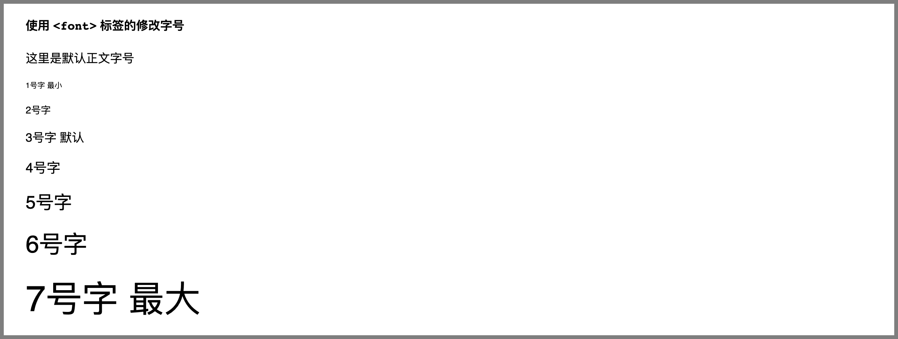
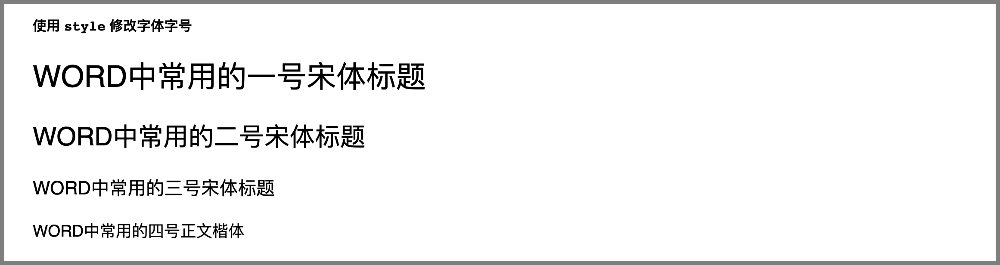

# Markdown 字体、字号

[toc]

## 1. 前言

字体是丰富排版效果的主要方式。一篇文章中会通过不同的字体字号来区分文字的作用，例如使用「黑体」，「一号字」作为标题，使用「宋体」、「四号字」作为正文等。

Markdown 使普通文本具有格式，但它的原生语法并不支持修改字体、字号。为了实现丰富文字样式的需求，我们需要通过增加 HTML 标签实现此类效果。

**环境说明**：
考虑到 Markdown 工具之间的不兼容，有的内容直接从页面复制粘贴到本地不会正常显示，大家学习时自己动手写是肯定没问题的。本节所有实例代码及演示效果均使用 Typora 工具完成。
本节所有截图均为 Typora 导出为 HTML 后渲染效果。


## 2. 语法详解


### 2.1 改变字体

#### 2.1.1 修改局部字体

在 Markdown 文件中，建议使用 `<font>` 标签的 `face` 属性修改文字字体。

**实例 1**：

```markdown
#### 使用 `<font>` 标签的修改字体

这里是默认字体

<font face="HEI">这里是黑体</font>

<font face="KAI">这里是楷体</font>

<font face="GB18030 Bitmap">这里是扩展字体</font>

<style>
p {font-size: 2rem;}
</style>
代码块12345678910111213
```

其渲染结果如下：


#### 2.1.2 常用字体

字体在不同环境中支持程度不同，表现结果可能也不同。在设计上，尽量选择较为通用的字体。以下是一些 Web 常用中文字体：

| 字体中文名称 | 字体写法                        |
| :----------- | :------------------------------ |
| 黑体         | `<font face='SimHei'>`          |
| 宋体         | `<font face='SimSun'>`          |
| 新宋体       | `<font face='NSimSun'>`         |
| 仿宋         | `<font face='FangSong'>`        |
| 楷体         | `<font face='KaiTi'>`           |
| 仿宋_GB2312  | `<font face='FangSong_GB2312'>` |
| 楷体_GB2312  | `<font face='KaiTi_GB2312'>`    |
| 微软雅黑     | `<font face='Microsoft YaHei'>` |


### 2.2 改变字号

Markdown 文档中的字号定义有三种主要方式，第一种是使用 `<font>` 标签；第二种通过 `<big>` 或者 `<small>` 标签；第三种是通过修改 `style` 样式实现。

#### 2.2.1 使用 `<font>` 标签 `size` 属性修改局部字号

**实例 2**：

```markdown
#### 使用 `<font>` 标签的修改字号

这里是默认正文字号

<font size="1">1号字 最小</font>

<font size="2">2号字</font>

<font size="3">3号字 默认</font>

<font size="4">4号字</font>

<font size="5">5号字</font>

<font size="6">6号字</font>

<font size="7">7号字 最大</font>
代码块1234567891011121314151617
```

其渲染结果如下：



#### 2.2.2 使用 `<big>` 和 `<small>` 标签修改局部字号

**实例 3**：

```markdown
#### 使用 `<big>` 或 `<small>` 标签的修改字号

这段文字里既包含<big>放大了的文字</big>，也包含<small>缩小了的文字</small>
代码块123
```

其渲染结果如下：


### 2.3 全局字体字号的设置

**实例 4**：

使用 `style` 样式修改全局字体和字号。

```markdown
#### 使用 `style` 修改字体字号

# WORD中常用的一号宋体标题

## WORD中常用的二号宋体标题

### WORD中常用的三号宋体标题

Word 中常用的四号正文楷体

<style>
h1 { font: 26pt song !important; }
h2 { font: 22pt song !important; }
h3 { font: 16pt song !important; }
p { font: 14pt kai !important; }
</style>
代码块12345678910111213141516
```

其渲染结果如下：




## 3. 使用场景及应用实例

全局字体字号的修改通常用于对格式有严格要求的场景，比如毕业论文、或者招投标书之类的官方文档。

局部字体字号的修改更常见于个人博客类文章、用多元化的字体形式丰富文章的 “性格”。

**实例 5**：

制作一段标签云效果。

```markdown
#### 标签云实例

<font face="KAI" size=5>大江东去</font>
<font face="KAI" size=3>海之一粟</font>
<font face="KAI">江海寄余生</font>
<font face="song" size=5>天涯何处无芳草</font>  
<font face="KAI" size=5>一蓑烟雨任平生</font>
<font face="HEI" size=7>苏东坡</font>
<font face="HEI" size=4>寂寞沙洲冷</font>  
<font size=6>但愿人长久</font>
<font size=5>十年生死两茫茫</font>
<font size=2>诗酒趁年华</font>
代码块123456789101112
```

其渲染结果如下：


## 4. 小结

1. 写正式文档尽量使用全局字体，写个人文档可以更自由的发挥；
2. 字号的定义尽量不要使用固定值，比如 `size=2` 或者 `font-size: 20px`，对于一种整体性较好，适应多种分辨率的布局形式，可以多使用相应字号如 `<big>`、`<small>`、`font-size: 2rem` 等；
3. 字体效果与电脑中已安装的字体文件有关，由于电脑使用者、操作系统间的差异，同一 Markdown 在不同的电脑上表现可能会不同，请尽量使用通用字体。

尽量不要主动定义 Markdown 文档中字体，如果 Markdown 中字体定义过多，维护的成本会很高。当我们需要修改字体字号的时候，请尽量使用 `<font>` 标签，因为 `<font>` 标签语义明确。