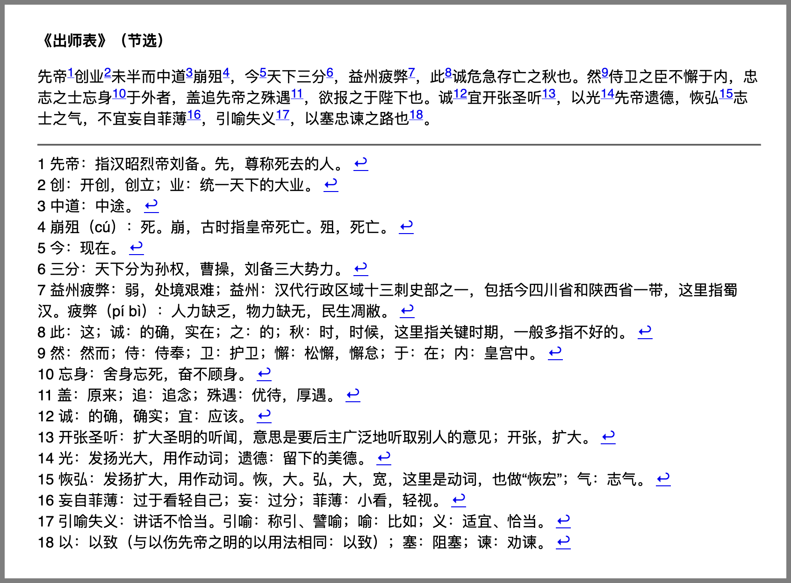

# Markdown 脚注尾注


## 1. 前言

脚注和尾注都是对文章的补充说明。

脚注通常与被注释内容出现在同一页，并位于该页面的最下方，一般用来解释专有名词、数据来源等。

尾注通常出现在文章的最后一页，写在文章全部正文之后，一般用来列明引用的文章列表等。

**环境说明**：
考虑到 Markdown 工具之间的不兼容，有的内容直接从页面复制粘贴到本地不会正常显示，大家学习时自己动手写是肯定没问题的。本节所有实例代码及演示效果均使用 Typora 工具完成。
本节所有渲染后效果截图均为 Typora 导出成 HTML 后的显示效果。


## 2. 语法详解


### 2.1 脚注、尾注的声明

#### 2.1.1 添加引用的描述

要增加脚注（尾注），首先需要在文章的适当位置增加引用的描述，形如：`[^引用ID]: 说明文字`。

**实例 1**：

脚注的声明。

```markdown
[^footnote]: 此处是 **脚注** 的 *文本内容*。
代码块1
```

注意，此步完成后，不会有渲染的内容输出，必须将引用添加到内容中才有显示。

#### 2.1.2 引用部位添加引用注释

在需要增加引用标记的内容后面增加 `[^引用ID]`。

**实例 2**：

完整的脚注。

```markdown
这里有一个脚注[^脚注ID1]。

这里有一个脚注[^脚注ID2]。


[^脚注ID1]: 此处是 **脚注** 的 *文本内容*。
[^脚注ID2]: 此处是 **脚注** 的 *文本内容*。
代码块1234567
```

该内容会被渲染成：


可以看到脚注的标号会自动编号。

其 Html 代码为：

```html
<p>这里有一个脚注<sup class="md-footnote"><a href="#dfref-footnote-1" name="ref-footnote-1">1</a></sup>。</p> 
<p>这里有一个脚注<sup class="md-footnote"><a href="#dfref-footnote-2" name="ref-footnote-2">2</a></sup>。</p> 

<div class="footnotes-area">
  <hr /> 
  <div class="footnote-line">
    <span class="md-fn-count">1</span> 此处是 
    <strong>脚注</strong> 的 
    <em>文本内容</em>。 
    <a name="dfref-footnote-1" href="#ref-footnote-1" title="回到文档" class="reversefootnote">↩</a> 
  </div> 
  <div class="footnote-line">
    <span class="md-fn-count">2</span> 此处是 
    <strong>脚注</strong> 的 
    <em>文本内容</em>。 
    <a name="dfref-footnote-2" href="#ref-footnote-2" title="回到文档" class="reversefootnote">↩</a>
  </div>
</div> 
代码块123456789101112131415161718
```

在 Markdown 中，尾注和脚注的声明方式是一样的，区别在于是否把引用的描述部分写到了文章的最末尾。由于 Markdown 在一些特定渲染输出的情况下（比如：PDF）才有分页的概念，所以我们优先采用尾注的形式，也就是将注释内容写到文章末尾。


## 3. 使用场景及实例

**实例 4**：

实现百度文库效果的《出师表》。

^[^注释1]创业[^注释2]未半而中道[^注释3]崩殂[^注释4]，今[^注释5]天下三分[^注释6]，益州疲弊[^注释7]，此[^注释8]诚危急存亡之秋也。然[^注释9]侍卫之臣不懈于内，忠志之士忘身[^注释10]于外者，盖追先帝之殊遇[^注释11]，欲报之于陛下也。诚[^注释12]宜开张圣听[^注释13]，以光[^注释14]先帝遗德，恢弘[^注释15]志士之气，不宜妄自菲薄[^注释16]，引喻失义[^注释17]，以塞忠谏之路也[^注释18]。

```markdown
**《出师表》（节选）**

先帝[^注释1]创业[^注释2]未半而中道[^注释3]崩殂[^注释4]，今[^注释5]天下三分[^注释6]，益州疲弊[^注释7]，此[^注释8]诚危急存亡之秋也。然[^注释9]侍卫之臣不懈于内，忠志之士忘身[^注释10]于外者，盖追先帝之殊遇[^注释11]，欲报之于陛下也。诚[^注释12]宜开张圣听[^注释13]，以光[^注释14]先帝遗德，恢弘[^注释15]志士之气，不宜妄自菲薄[^注释16]，引喻失义[^注释17]，以塞忠谏之路也[^注释18]。

[^注释1]: 先帝：指汉昭烈帝刘备。先，尊称死去的人。
[^注释2]: 创：开创，创立；业：统一天下的大业。
[^注释3]: 中道：中途。
[^注释4]: 崩殂（cú）：死。崩，古时指皇帝死亡。殂，死亡。
[^注释5]: 今：现在。
[^注释6]: 三分：天下分为孙权，曹操，刘备三大势力。
[^注释7]: 益州疲弊：弱，处境艰难；益州：汉代行政区域十三刺史部之一，包括今四川省和陕西省一带，这里指蜀汉。疲弊（pí bì）：人力缺乏，物力缺无，民生凋敝。
[^注释8]: 此：这；诚：的确，实在；之：的；秋：时，时候，这里指关键时期，一般多指不好的。
[^注释9]: 然：然而；侍：侍奉；卫：护卫；懈：松懈，懈怠；于：在；内：皇宫中。
[^注释10]: 忘身：舍身忘死，奋不顾身。
[^注释11]: 盖：原来；追：追念；殊遇：优待，厚遇。
[^注释12]: 诚：的确，确实；宜：应该。
[^注释13]: 开张圣听：扩大圣明的听闻，意思是要后主广泛地听取别人的意见；开张，扩大。
[^注释14]: 光：发扬光大，用作动词；遗德：留下的美德。
[^注释15]: 恢弘：发扬扩大，用作动词。恢，大。弘，大，宽，这里是动词，也做“恢宏”；气：志气。
[^注释16]: 妄自菲薄：过于看轻自己；妄：过分；菲薄：小看，轻视。
[^注释17]: 引喻失义：讲话不恰当。引喻：称引、譬喻；喻：比如；义：适宜、恰当。
[^注释18]: 以：以致（与以伤先帝之明的以用法相同：以致）；塞：阻塞；谏：劝谏。
代码块12345678910111213141516171819202122
```

其渲染效果如下：




## 4. 小结

- 尾注和脚注是用来对文字内容做补充说明的标记格式；
- 尾注和脚注声明的方式与超链接很像，但比超链接多了一个 `^` 符号；
- 尾注和脚注在 Markdown 的写法一样，区别在于不同其注释描述的插入位置不同；
- 对于不分页的文章，建议优先采用尾注的形式，保证格式的统一。


[^注释1]: 先帝：指汉昭烈帝刘备。先，尊称死去的人。
[^注释2]: 创：开创，创立；业：统一天下的大业。
[^注释3]: 中道：中途。
[^注释4]: 崩殂（cú）：死。崩，古时指皇帝死亡。殂，死亡。
[^注释5]: 今：现在。
[^注释6]: 三分：天下分为孙权，曹操，刘备三大势力。
[^注释7]: 益州疲弊：弱，处境艰难；益州：汉代行政区域十三刺史部之一，包括今四川省和陕西省一带，这里指蜀汉。疲弊（pí bì）：人力缺乏，物力缺无，民生凋敝。
[^注释8]: 此：这；诚：的确，实在；之：的；秋：时，时候，这里指关键时期，一般多指不好的。
[^注释9]: 然：然而；侍：侍奉；卫：护卫；懈：松懈，懈怠；于：在；内：皇宫中。
[^注释10]: 忘身：舍身忘死，奋不顾身。
[^注释11]: 盖：原来；追：追念；殊遇：优待，厚遇。
[^注释12]: 诚：的确，确实；宜：应该。
[^注释13]: 开张圣听：扩大圣明的听闻，意思是要后主广泛地听取别人的意见；开张，扩大。
[^注释14]: 光：发扬光大，用作动词；遗德：留下的美德。
[^注释15]: 恢弘：发扬扩大，用作动词。恢，大。弘，大，宽，这里是动词，也做“恢宏”；气：志气。
[^注释16]: 妄自菲薄：过于看轻自己；妄：过分；菲薄：小看，轻视。
[^注释17]: 引喻失义：讲话不恰当。引喻：称引、譬喻；喻：比如；义：适宜、恰当。
[^注释18]: 以：以致（与以伤先帝之明的以用法相同：以致）；塞：阻塞；谏：劝谏。