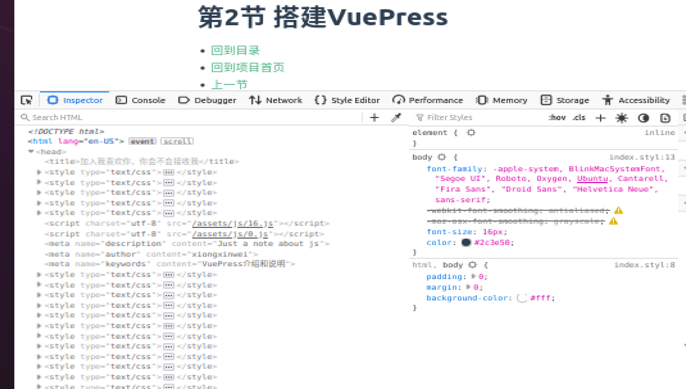

+ [author](https://github.com/3293172751)

# 第4节 基本配置

+ [回到目录](../README.md)
+ [回到项目首页](../../README.md)
+ [上一节](3.md)
> ❤️💕💕VuePress入门文档。Myblog:[http://nsddd.top](http://nsddd.top/)
---
[TOC]

+ 类型: `string`
+ 默认值: `/`

部署站点的基础路径，如果你想让你的网站部署到一个子路径下，你将需要设置它。如 GitHub pages，如果你想将你的网站部署到 `https://foo.github.io/bar/`，那么 `base` 应该被设置成 `"/bar/"`，它的值应当总是以斜杠开始，并以斜杠结束。	

`base` 将会作为前缀自动地插入到所有以 `/` 开始的其他选项的链接中，所以你只需要指定一次。

**参考:**

+ [Base URL](https://vuepress.vuejs.org/zh/guide/assets.html#基础路径)
+ [部署指南 > GitHub Pages](https://vuepress.vuejs.org/zh/guide/deploy.html#github-pages)

### title

+ 类型: `string`
+ 默认值: `undefined`

网站的标题，它将会被用作所有页面标题的前缀，同时，默认主题下，它将显示在导航栏（navbar）上。

### description

+ 类型: `string`
+ 默认值: `undefined`

网站的描述，它将会以 `<meta>` 标签渲染到当前页面的 HTML 中。

### [#](https://vuepress.vuejs.org/zh/config/#head)head

+ 类型: `Array`
+ 默认值: `[]`

额外的需要被注入到当前页面的 HTML `<head>` 中的标签，每个标签都可以以 `[tagName, { attrName: attrValue }, innerHTML?]` 的格式指定，举个例子，增加一个自定义的 favicon：

```js
module.exports = {
  head: [
    ['link', { rel: 'icon', href: '/logo.png' }]
  ]
}
```

**可以如下的说明：**

```
title: '加入我喜欢你，你会不会接收我',
  description: 'Just a note about js',
  head: [
  	['link',{rel: 'icon', href: 'https://s2.loli.net/2022/07/26/QvB6oeYRHFrqwlg.png'}]
    ['meta',{name:"author",content:'xiongxinwei'}],
    ['meta',{name:"keywords",content:'VuePress介绍和说明'}],
  ],  
```



> `/logo.png`中放的是图片路径，对应的是SEO，可以是商标，推荐网站
>
> + [favicon.io](https://favicon.io/)

+ 类型: `string`
+ 默认值: `'0.0.0.0'`

指定用于 dev server 的主机名。

### port

+ 类型: `number`
+ 默认值: `8080`

指定 dev server 的端口。

### temp

+ Type: `string`
+ Default: `/path/to/@vuepress/core/.temp`

指定客户端文件的临时目录。

###  dest

+ 类型: `string`
+ 默认值: `.vuepress/dist`

指定 `vuepress build` 的输出目录。如果传入的是相对路径，则会基于 `process.cwd()` 进行解析。

### locales

+ 类型: `{ [path: string]: Object }`
+ 默认值: `undefined`

提供多语言支持的语言配置。具体细节请查看 [多语言支持](https://vuepress.vuejs.org/zh/guide/i18n.html)。

### shouldPrefetch

+ 类型: `Function`
+ 默认值: `() => true`

一个函数，用来控制对于哪些文件，是需要生成 `<link rel="prefetch">` 资源提示的。请参考 [shouldPrefetch (opens new window)](https://ssr.vuejs.org/zh/api/#shouldprefetch)。

### cache

+ 类型: `boolean|string`
+ 默认值: `true`

VuePress 默认使用了 [cache-loader (opens new window)](https://github.com/webpack-contrib/cache-loader)来大大地加快 webpack 的编译速度。

此选项可以用于指定 cache 的路径，同时也可以通过设置为 `false` 来在每次构建之前删除 cache。

提示

这个选项也可以通过命令行来使用：

```bash
vuepress dev docs --cache .cache # 设置 cache 路径
vuepress dev docs --no-cache     # 在每次构建前删除 cache
```

### extraWatchFiles

+ 类型: `Array`
+ 默认值: `[]`

指定额外的需要被监听的文件。

你可以监听任何想监听的文件，文件变动将会触发 `vuepress` 重新构建，并实时更新。

```js
module.exports = {
  extraWatchFiles: [
    '.vuepress/foo.js', // 使用相对路径
    '/path/to/bar.js'   // 使用绝对路径
  ]
}
```

### patterns

+ Type: `Array`
+ Default: `['**/*.md', '**/*.vue']`

Specify which pattern of files you want to be resolved.

## Styling

### palette.styl

如果要对[默认预设 (opens new window)](https://github.com/vuejs/vuepress/blob/master/packages/@vuepress/core/lib/client/style/config.styl)的样式进行简单的替换，或者定义一些变量供以后使用，你可以创建一个 `.vuepress/styles/palette.styl` 文件。

你可以调整的一些变量如下:

```stylus
// 颜色
$accentColor = #3eaf7c
$textColor = #2c3e50
$borderColor = #eaecef
$codeBgColor = #282c34
$arrowBgColor = #ccc
$badgeTipColor = #42b983
$badgeWarningColor = darken(#ffe564, 35%)
$badgeErrorColor = #DA5961

// 布局
$navbarHeight = 3.6rem
$sidebarWidth = 20rem
$contentWidth = 740px
$homePageWidth = 960px

// 响应式变化点
$MQNarrow = 959px
$MQMobile = 719px
$MQMobileNarrow = 419px
```

警告

你应该**只在**这个文件中定义变量。因为 `palette.styl` 将在根的 stylus 配置文件的末尾引入，作为配置，它将被多个文件使用，所以一旦你在这里写了样式，你的样式就会被多次复制。

### index.styl

VuePress 提供了一种添加额外样式的简便方法。你可以创建一个 `.vuepress/styles/index.styl` 文件。这是一个 [Stylus (opens new window)](http://stylus-lang.com/)文件，但你也可以使用正常的 CSS 语法。

```stylus
.content {
  font-size 30px
}
```

注意

由于背后的行为，不论是在 `palette.styl` 或是 `index.styl` ，都不能透过 [@import / @require (opens new window)](https://stylus-lang.com/docs/import.html)從**相对路径**引用一般的 `.css` 样式表。

<details class="custom-block details" style="display: block; position: relative; border-radius: 2px; margin: 1.6em 0px; padding: 1.6em; background-color: rgb(238, 238, 238); color: rgb(44, 62, 80); font-family: -apple-system, BlinkMacSystemFont, &quot;Segoe UI&quot;, Roboto, Oxygen, Ubuntu, Cantarell, &quot;Fira Sans&quot;, &quot;Droid Sans&quot;, &quot;Helvetica Neue&quot;, sans-serif; font-size: 16px; font-style: normal; font-variant-ligatures: normal; font-variant-caps: normal; font-weight: 400; letter-spacing: normal; orphans: 2; text-align: start; text-indent: 0px; text-transform: none; white-space: normal; widows: 2; word-spacing: 0px; -webkit-text-stroke-width: 0px; text-decoration-thickness: initial; text-decoration-style: initial; text-decoration-color: initial;"><summary style="outline: none; cursor: pointer;">那如果你非得要 import / require 一般的 `.css` 样式表呢？</summary><p style="line-height: 1.7;"><strong style="font-weight: 600;"></strong></p><ol style="padding-left: 1.2em; line-height: 1.7;"><li></li></ol><div class="language-stylus extra-class" style="position: relative; background-color: rgb(40, 44, 52); border-radius: 6px;"><pre class="language-stylus" style="color: rgb(204, 204, 204); background: transparent; font-family: Consolas, Monaco, &quot;Andale Mono&quot;, &quot;Ubuntu Mono&quot;, monospace; font-size: 1em; text-align: left; white-space: pre; word-spacing: normal; word-break: normal; overflow-wrap: normal; line-height: 1.4; tab-size: 4; hyphens: none; padding: 1.25rem 1.5rem; margin: 0.85rem 0px; overflow: auto; border-radius: 6px; position: relative; z-index: 1;"><code style="font-family: source-code-pro, Menlo, Monaco, Consolas, &quot;Courier New&quot;, monospace; color: rgb(255, 255, 255); padding: 0px; margin: 0px; font-size: 0.85em; background-color: transparent; border-radius: 0px;"><span class="token atrule-declaration"><span class="token atrule" style="color: rgb(204, 153, 205);"></span><span class="token string" style="color: rgb(126, 198, 153);"></span></span></code></pre></div><ol start="2" style="padding-left: 1.2em; line-height: 1.7;"><li></li></ol><p style="line-height: 1.7;"><a href="https://vuepress.vuejs.org/zh/plugin/option-api.html#alias" class="" style="font-weight: 500; text-decoration: none; color: rgb(62, 175, 124);"></a></p><div class="language-js extra-class" style="position: relative; background-color: rgb(40, 44, 52); border-radius: 6px;"><pre class="language-js" style="color: rgb(204, 204, 204); background: transparent; font-family: Consolas, Monaco, &quot;Andale Mono&quot;, &quot;Ubuntu Mono&quot;, monospace; font-size: 1em; text-align: left; white-space: pre; word-spacing: normal; word-break: normal; overflow-wrap: normal; line-height: 1.4; tab-size: 4; hyphens: none; padding: 1.25rem 1.5rem; margin: 0.85rem 0px; overflow: auto; border-radius: 6px; position: relative; z-index: 1;"><code style="font-family: source-code-pro, Menlo, Monaco, Consolas, &quot;Courier New&quot;, monospace; color: rgb(255, 255, 255); padding: 0px; margin: 0px; font-size: 0.85em; background-color: transparent; border-radius: 0px;"><span class="token comment" style="color: rgb(153, 153, 153);"></span><span class="token literal-property property" style="color: rgb(248, 197, 85);"></span><span class="token operator" style="color: rgb(103, 205, 204);"></span><span class="token punctuation" style="color: rgb(204, 204, 204);"></span><span class="token string-property property" style="color: rgb(248, 197, 85);"></span><span class="token operator" style="color: rgb(103, 205, 204);"></span><span class="token punctuation" style="color: rgb(204, 204, 204);"></span><span class="token function" style="color: rgb(240, 141, 73);"></span><span class="token punctuation" style="color: rgb(204, 204, 204);"></span><span class="token punctuation" style="color: rgb(204, 204, 204);"></span><span class="token string" style="color: rgb(126, 198, 153);"></span><span class="token punctuation" style="color: rgb(204, 204, 204);"></span><span class="token punctuation" style="color: rgb(204, 204, 204);"></span></code></pre></div><div class="language-stylus extra-class" style="position: relative; background-color: rgb(40, 44, 52); border-radius: 6px;"><pre class="language-stylus" style="color: rgb(204, 204, 204); background: transparent; font-family: Consolas, Monaco, &quot;Andale Mono&quot;, &quot;Ubuntu Mono&quot;, monospace; font-size: 1em; text-align: left; white-space: pre; word-spacing: normal; word-break: normal; overflow-wrap: normal; line-height: 1.4; tab-size: 4; hyphens: none; padding: 1.25rem 1.5rem; margin: 0.85rem 0px; overflow: auto; border-radius: 6px; position: relative; z-index: 1;"><code style="font-family: source-code-pro, Menlo, Monaco, Consolas, &quot;Courier New&quot;, monospace; color: rgb(255, 255, 255); padding: 0px; margin: 0px; font-size: 0.85em; background-color: transparent; border-radius: 0px;"><span class="token atrule-declaration"><span class="token atrule" style="color: rgb(204, 153, 205);"></span><span class="token string" style="color: rgb(126, 198, 153);"></span></span></code></pre></div></details>

**参考:**

+ [为什么不能把 `palette.styl` 和 `index.styl` 合并到一个 API?](https://vuepress.vuejs.org/zh/faq/#为什么不能把-palette-styl-和-index-styl-合并到一个-api)

## 主题

### theme

+ 类型: `string`
+ 默认值: `undefined`

当你使用自定义主题的时候，需要指定它。

**参考:**

+ [使用主题](https://vuepress.vuejs.org/zh/theme/using-a-theme.html).

### themeConfig

+ 类型: `Object`
+ 默认值: `{}`

为当前的主题提供一些配置，这些选项依赖于你正在使用的主题。

**也可以参考:**

+ [默认主题](https://vuepress.vuejs.org/zh/theme/default-theme-config.html)。

## Pluggable

### plugins

+ 类型: `Object|Array`
+ 默认值: `undefined`

请参考 [plugin > Using a plugin](https://vuepress.vuejs.org/zh/plugin/using-a-plugin.html) 来使用一个插件。

## Markdown

### markdown.lineNumbers

+ 类型: `boolean`
+ 默认值: `undefined`

是否在每个代码块的左侧显示行号。

**参考:**

+ [行号](https://vuepress.vuejs.org/zh/guide/markdown.html#行号)

### markdown.slugify

+ 类型: `Function`
+ 默认值: [source(opens new window)](https://github.com/vuejs/vuepress/tree/master/packages/@vuepress/shared-utils/src/slugify.ts)

一个将标题文本转换为 slug 的函数。修改它会影响 [标题](https://vuepress.vuejs.org/zh/miscellaneous/glossary.html#headers)、[目录](https://vuepress.vuejs.org/zh/guide/markdown.html#目录)、以及[侧边栏](https://vuepress.vuejs.org/zh/theme/default-theme-config.html#侧边栏)链接的 id 和 链接。

### markdown.anchor

+ 类型: `Object`
+ 默认值: `{ permalink: true, permalinkBefore: true, permalinkSymbol: '#' }`

[markdown-it-anchor (opens new window)](https://github.com/valeriangalliat/markdown-it-anchor)的选项。

### markdown.pageSuffix

+ 类型: `string`
+ 默认值: `.html`

Option to customize internal links to be compatible when using the [vuepress-plugin-clean-urls (opens new window)](https://vuepress.github.io/en/plugins/clean-urls/).

### markdown.externalLinks

+ 类型: `Object`
+ 默认值: `{ target: '_blank', rel: 'noopener noreferrer' }`

这个键值对将会作为特性被增加到是外部链接的 `<a>` 标签上，默认的选项将会在新窗口中打开一个该外部链接。

### markdown.toc

+ 类型: `Object`
+ 默认值: `{ includeLevel: [2, 3] }`

[markdown-it-table-of-contents (opens new window)](https://github.com/Oktavilla/markdown-it-table-of-contents)的选项。

### markdown.plugins

你可以使用 `markdown.plugins` 来安装 markdown-it 插件。它的使用方法与[安装一个 VuePress 插件](https://vuepress.vuejs.org/zh/plugin/using-a-plugin.html#using-a-plugin)类似。你可以使用 Babel 语法或对象语法。`markdown-it-` 前缀同样是可以忽略的。

```js
module.exports = {
  markdown: {
    plugins: [
      '@org/foo', // 等价于 @org/markdown-it-foo，如果对应的包存在
      ['markdown-it-bar', {
        // 提供你的选项
      }]
    ]
  }
}
```

or

```js
module.exports = {
  markdown: {
    plugins: {
      '@org/foo': {}
      'markdown-it-bar': {
        // 提供你的选项
      }
    }
  }
}
```

### markdown.extendMarkdown

+ 类型: `Function`
+ 默认值: `undefined`

一个用于修改当前的 [markdown-it (opens new window)](https://github.com/markdown-it/markdown-it)实例的默认配置，或者应用额外的插件的函数，举例如下：

```js
module.exports = {
  markdown: {
    extendMarkdown: md => {
      md.set({ breaks: true })
      md.use(require('markdown-it-xxx'))
    }
  }
}
```

提示

这个选项也被 [Plugin API](https://vuepress.vuejs.org/zh/plugin/option-api.html#extendmarkdown) 所支持。

### markdown.extractHeaders

+ 类型: `Array`
+ 默认值: `['h2', 'h3']`

Markdown 文件的 headers (标题 & 小标题) 会在准备阶段被提取出来，并存储在 `this.$page.headers` 中。默认情况下，VuePress 会提取 `h2` 和 `h3` 标题。你可以通过这个选项来修改提取出的标题级别。

```js
module.exports = {
  markdown: {
    extractHeaders: [ 'h2', 'h3', 'h4' ]
  }
}
```

## 构建流程

### postcss

+ 类型: `Object`
+ 默认值: `{ plugins: [require('autoprefixer')] }`

[postcss-loader (opens new window)](https://github.com/postcss/postcss-loader)的选项，请注意，指定这个值，将会覆盖内置的 autoprefixer，所以你需要自己将它加进去。

### stylus

+ 类型: `Object`
+ 默认值: `{ preferPathResolver: 'webpack' }`

[stylus-loader (opens new window)](https://github.com/shama/stylus-loader)的选项。

### scss

+ 类型: `Object`
+ 默认值: `{}`

加载 `*.scss` 文件的 [sass-loader (opens new window)](https://github.com/webpack-contrib/sass-loader)的选项。

### sass

+ 类型: `Object`
+ 默认值: `{ indentedSyntax: true }`

加载 `*.sass` 文件的 [sass-loader (opens new window)](https://github.com/webpack-contrib/sass-loader)的选项。

### less

+ 类型: `Object`
+ Default: `{}`

[less-loader (opens new window)](https://github.com/webpack-contrib/less-loader)的选项。

### configureWebpack

+ 类型: `Object | Function`
+ 默认值: `undefined`

用于修改内部的 Webpack 配置。如果给定一个对象，那么它将会被 [webpack-merge (opens new window)](https://github.com/survivejs/webpack-merge)合并到最终的配置中，如果给定一个函数，它将会接受 `config` 作为第一个参数，以及 `isServer` 作为第二个参数，你可以直接更改 `config`，也可以返回一个待合并的对象。

```js
module.exports = {
  configureWebpack: (config, isServer) => {
    if (!isServer) {
      // 修改客户端的 webpack 配置
    }
  }
}
```

### chainWebpack

+ 类型: `Function`
+ 默认值: `undefined`

通过 [webpack-chain (opens new window)](https://github.com/mozilla-neutrino/webpack-chain)来修改内部的 Webpack 配置。

```js
module.exports = {
  chainWebpack: (config, isServer) => {
    // config 是 ChainableConfig 的一个实例
  }
}
```

## 浏览器兼容性

### evergreen

+ 类型: `boolean | Function`
+ 默认值: `false`

如果你的对象只有那些 “常青树” 浏览器，你可以将其设置成 `true`，这将会禁止 ESNext 到 ES5 的转译以及对 IE 的 polyfills，同时会带来更快的构建速度和更小的文件体积。


## END 链接
+ [回到目录](../README.md)
+ [上一节](3.md)
+ [下一节](5.md)
---
+ [参与贡献❤️💕💕](https://github.com/3293172751/Block_Chain/blob/master/Git/git-contributor.md)