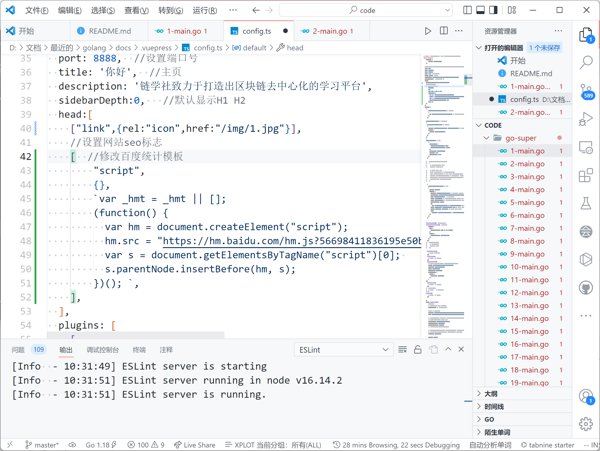

+ [author](https://github.com/3293172751)

# 第20节 v2引入百度统计及其他库

+ [回到目录](../README.md)
+ [回到项目首页](../../README.md)
+ [上一节](19.md)
> ❤️💕💕VuePress入门文档。Myblog:[http://nsddd.top](http://nsddd.top/)
---
[TOC]

## 百度统计

+ [x] [百度统计的地址](https://tongji.baidu.com/main/homepage/10000496583/homepage/index)

> 在halo博客里面后台也有百度统计，百度统计作为接口给博客带来很大的帮助

百度统计官方的引入版本是在html的头部引用一个js代码。vuepress 2也是这个逻辑，但是具体的引入办法不同。

> 点击，新建使用设置，新建网站


> 获取代码


#### 配置 config 文件

> 因为 vuepress 是静态渲染服务，所以更换路由不会刷新页面，所以要进行第三步配置，[监听](https://so.csdn.net/so/search?q=监听&spm=1001.2101.3001.7020)路由变化，反馈到百度统计




####  添加 config 同级文件：enhanceApp.js，添加如下代码


`vuepress2`需要在`.vuepress/config.js`里面进行修改，修改`head`这个字段：

```js
const { path } = require('@vuepress/utils')
……
 
module.exports = {
  // site config
  lang: 'zh-CN',
  title: '百家饭OpenAPI平台',
  description: '百家饭OpenAPI平台主站',
  head: [['script', {}, `
  var _hmt = _hmt || [];
  (function() {
    var hm = document.createElement("script");
    hm.src = "https://hm.baidu.com/hm.js?xcsafasdffsadfafd";
    var s = document.getElementsByTagName("script")[0]; 
    s.parentNode.insertBefore(hm, s);
  })();
  `], ['script', { 'src': "https://res.wx.qq.com/open/js/jweixin-1.6.0.js" }]],
```

可以看到，我们设置head为一个数组的数组，里面的每一个数组元素的定义如下：

```js
export type HeadConfig =
  | [HeadTagEmpty, HeadAttrsConfig]
  | [HeadTagNonEmpty, HeadAttrsConfig, string]
```

其中，第一个属性是`HeadTagEmpty`或者`HeadTagNonEmpty`，`HeadTagEmpty`可以是：`'base' | 'link' |` 、`'meta' | 'script'`。

`HeadTagNonEmpty`可以是`'title' | 'style' | 'script' | 'noscript' | 'template'`，我们增加的两个`script`，一个是带内容的`HeadTagNonEmpty`，一个是不带内容的`HeadTagEmpty`。带内容的就是引入百度搜索的部分，直接把百度搜索页面中要求引入的js粘贴进来就可以了。

同时，第二个是引入微信js的功能。引入后，就可以使用wx.xxx来调用相关功能了。


## 引入sitemap

同时，为了支持google搜索索引，我们还引入了sitemap生成插件来生成sitemap，还是在config.js里面，引入下面的内容：

```js
const { path } = require('@vuepress/utils')
const { sitemapPlugin } = require("vuepress-plugin-sitemap2");
……
 
module.exports = {
  // site config
  lang: 'zh-CN',
  title: '百家饭OpenAPI平台',
  description: '百家饭OpenAPI平台主站',
  ……
  plugins: [
    sitemapPlugin({
      hostname: "https://rongapi.cn"
    }),
  ],
```

注意第二行的内容，这个sitemapPlugin的正式名称是vuepress-plugin-sitemap2，这是他的npm链接：

```
vuepress-plugin-sitemap2 - npm (npmjs.com)
```

同样，我们使用的是v2版本

引入该插件，会在生成的dist文件夹下生成sitemap.xml文件，我们传入了hostname作为标准生成的服务器地址，具体配置可以进入上面的链接查看。

引入其他库时的注意事项
上面我们大体介绍了和搜索相关的两个库的引入方法。其他的库，基本都是import进来的，其实用法和普通vue区别不大。需要注意的一个问题是SSR判断问题。

例如我们用到了dayjs等库，还用到了particlesJS在主页生成一个随机图形


很多库都是只能在客户端环境下才可以使用的纯前端库，这种库，我们就不能直接import使用，如果使用，特别容易在编译的时候出错（dev的时候一般不出错）。这时，我们就需要把import放到__VUEPRESS_SSR__判断里面，并改成异步import，例如：

```js
<script setup>
 
if (!__VUEPRESS_SSR__) {
  import("./particles.js").then(() => {
    window.particlesJS.load(
      "particles",
      "/assets/particles.json",
      function () {}
    );
  });
}
```

 判断__VUEPRESS_SSR__确保我们这段代码只在客户端会被调用，而在服务器渲染部分会跳过。这种错误在ssr阶段报错比较隐蔽，我们遇到过的包括

 require() of ES Module xxx.mjs not supported.

Invalid value used as weak map key at WeakMap.set (<anonymous>)

window is not defined

如果你遇到上面三种错误，都可以尝试我们的解决方案。

## END 链接

+ [回到目录](../README.md)
+ [上一节](19.md)
+ [下一节](21.md)
---
+ [参与贡献❤️💕💕](https://github.com/3293172751/Block_Chain/blob/master/Git/git-contributor.md)