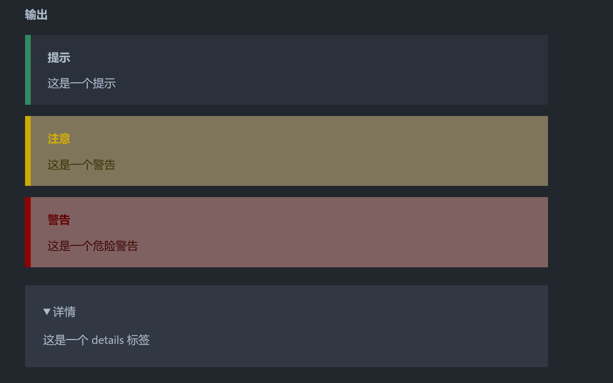
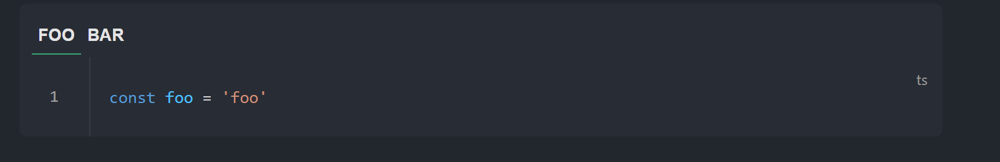

+ [author](https://github.com/3293172751)

# 第27节 markdown自定义容器

+ [回到目录](../README.md)
+ [回到项目首页](../../README.md)
+ [上一节](26.md)
> ❤️💕💕VuePress入门文档。Myblog:[http://nsddd.top](http://nsddd.top/)
---
[TOC]

## 自定义容器

+ 使用：

  ```
  ::: <type> [title]
  [content]
  :::
  ```

  `type` 是必需的， `title` 和 `content` 是可选的。

  支持的 `type` 有：

  + `tip`
  + `warning`
  + `danger`
  + `details`
  + `CodeGroup`和`CodeGroupItem`的别名：
    + `code-group`
    + `code-group-item`

+ 示例 1 （默认标题）：

**输入**

```
::: tip
这是一个提示
:::

::: warning
这是一个警告
:::

::: danger
这是一个危险警告
:::

::: details
这是一个 details 标签
:::
```

🚀 渲染结果如下：




## 自定义容器标题

~~~vue
::: danger STOP
危险区域，禁止通行
:::

::: details 点击查看代码
```ts
console.log('你好，VuePress！')
```
:::
~~~

🚀 渲染结果如下：


## 代码块设置别名

~~~vue
:::: code-group
::: code-group-item FOO
```ts
const foo = 'foo'
```
:::
::: code-group-item BAR
```ts
const bar = 'bar'
```
:::
::::
~~~

🚀 渲染结果如下：




## END 链接

+ [回到目录](../README.md)
+ [上一节](26.md)
+ [下一节](28.md)
---
+ [参与贡献❤️💕💕](https://github.com/3293172751/Block_Chain/blob/master/Git/git-contributor.md)