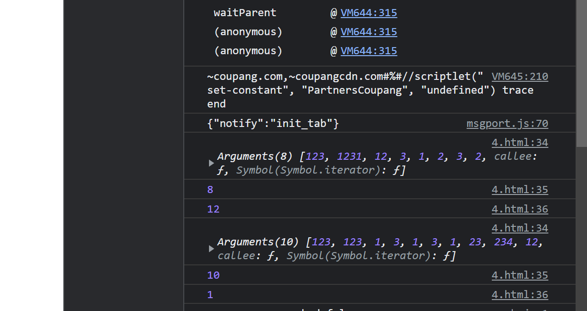

+ [author](https://github.com/3293172751)

# 第4节 对象（Object）

+ [回到目录](../README.md)
+ [回到项目首页](../../README.md)
+ [上一节](3.md)

> ❤️💕💕JavaSript学习,前期的HTML教程和后期VUE和flutter教程。Myblog:[http://nsddd.top](http://nsddd.top/)

---

[TOC]

+ [对应html代码](../code/4.html)

---

对象是JS中的引用数据类型 
**对象是一种复合数据类型，在对象中可以保存多个不同数据类型的属性** 
使用typeof检查一个对象时，会返回object 

## 对象的分类： 

1.内建对象 

 - 由ES标准中定义的对象，在任何的ES的实现中都可以使用 
   - 比如：Math String Number Boolean Function Object.... 

2.宿主对象 
	- 由JS的运行环境提供的对象，目前来讲主要指由浏览器提供的对象 
	- 比如 BOM DOM 

3.自定义对象 

	- 由开发人员自己创建的对象 

创建对象 
 方式一：

```javascript
var obj = new Object(); 
```

 方式二： 

 ```javascript
var obj = {}; 
 ```

**向对象中添加属性** 
 语法： 
	对象.属性名 = 属性值; 
	**对象["属性名"] = 属性值;**	//这种方式能够使用特殊的属性名 

 **对象的属性名没有任何要求，不需要遵守标识符的规范，但是在开发中，尽量按照标识符的要求去写。** 
属性值也可以任意的数据类型。 

读取对象中的属性 
 语法： 
	对象.属性名 
	对象["属性名"] //"属性名"可以使字符串常量，也可以是字符串变量 
 如果读取一个对象中没有的属性，它不会报错，而是返回一个undefined 

**删除对象中的属性** 
 语法： 

```javascript
delete 对象.属性名 
delete 对象["属性名"] 
```


## 遍历 

**使用in检查对象中是否含有指定属性** 
 语法："属性名" in 对象 
	 如果在对象中含有该属性，则返回true 
		如果没有则返回false 

     循环遍历对象自身的和继承的可枚举属性(不含Symbol属性). 

```javascript  
var obj = {'0':'a','1':'b','2':'c'}; 
 
for(var i in obj) { 
   console.log(i,":",obj[i]); 
} 
```


​	 
**使用对象字面量，在创建对象时直接向对象中添加属性** 
语法： 

```javascript
var obj = { 
  属性名:属性值, 
  属性名:属性值, 
  属性名:属性值, 
  属性名:属性值 
} 
```

基本数据类型和引用数据类型 
 基本数据类型 
	String Number Boolean Null Undefined 
 引用数据类型 
	Object 
 **基本数据类型的数据，变量是直接保存的它的值。** 
	变量与变量之间是互相独立的，修改一个变量不会影响其他的变量。 
 **引用数据类型的数据，变量是保存的对象的引用（内存地址）。** 
	如果多个变量指向的是同一个对象，此时修改一个变量的属性，会影响其他的变量。 
 比较两个变量时，对于基本数据类型，比较的就是值， 
	对于引用数据类型比较的是地址，地址相同才相同 	 

## 函数（Function）	 

**函数也是一个对象，也具有普通对象的功能（能有属性）** 
函数中可以封装一些代码，在需要的时候可以去调用函数来执行这些代码 
使用typeof检查一个函数时会返回function 
创建函数 
 函数声明 

```javascript
function 函数名([形参1,形参2...形参N]){ 
语句... 
} 
```

 函数表达式

```javascript
var 函数名 = function([形参1,形参2...形参N]){ 
语句... 
}; 
```

调用函数 
 语法：函数对象([实参1,实参2...实参N]); 
	fun() sum() alert() Number() parseInt() 
 当我们调用函数时，函数中封装的代码会按照编写的顺序执行 

**立即执行函数** 
函数定义完，立即被调用，这种函数叫做立即执行函数 
立即执行函数往往只会执行一次

```javascript
(function(a,b){ 
  console.log("a = "+a); 
  console.log("b = "+b); 
})(123,456); 
```

遍历对象 

```javascript  
for(var v in obj){ 
  document.write("property：name ="+v+"value="+obj[v]+"<br/>" ); 
} 
```


**形参和实参** 
形参：形式参数 

+ 定义函数时，可以在()中定义一个或多个形参，形参之间使用,隔开 
+ 定义形参就相当于在函数内声明了对应的变量但是并不赋值
+ 形参会在调用时才赋值。 
  		 
   **实参：实际参数** 

+ 调用函数时，可以在()传递实参，传递的实参会赋值给对应的形参,
  + 调用函数时JS解析器不会检查实参的类型和个数，可以传递任意数据类型的值。 

+ **如果实参的数量大于形参，多余实参将不会赋值，** 

+ **如果实参的数量小于形参，则没有对应实参的形参将会赋值undefined**  


**返回值，就是函数执行的结果。** 

+ 使用return 来设置函数的返回值。 

```javascript
function fn(num1,num2) {
	return num1,num2; 
  //return [num1+num2,num1-num2];
}
```

+ 上面代码最后以最后的一个返回值参数为准，return只能返回一个值，所以最后返回的是num2
+ 如果想要返回多个值，我们可以使用数组来存放。

语法：return 值; 
	 该值就会成为函数的返回值，可以通过一个变量来接收返回值 
 return后边的代码都不会执行，一旦执行到return语句时，函数将会立刻退出。 
 return后可以跟任意类型的值，可以是基本数据类型，也可以是一个对象。 
 **如果return后不跟值，或者是不写return则函数默认返回undefined。** 

```
 break、continue和return 
 break 
 	退出循环 
 continue 
 	跳过当次循环 
 return 
 	退出函数 
```

**参数，函数的实参也可以是任意的数据类型。** 

**方法（method）** 
 可以将一个函数设置为一个对象的属性， 
	当一个对象的属性是一个函数时， 
		我们称这个函数是该对象的方法。 
 对象.方法名();
 函数名()


### 函数的属性和方法

```
call() 
apply()
```

 **这两个方法都是函数对象的方法需要通过函数对象来调用** 

 通过两个方法可以直接调用函数，并且**可以通过第一个实参来指定函数中this** 

 不同的是call是直接传递函数的实参而apply需要将实参封装到一个数组中传递 


#### arguments

+ arguments和this类似，都是函数中的隐含的参数 

+ arguments是一个类数组元素，它用来封装函数执行过程中的实参 

+	所以即使不定义形参，也可以通过arguments来使用实参 
+	**arguments中有一个属性callee表示当前执行的函数对象** 

```javascript
function fn3(){
    console.log(arguments); //arguments里面存储所有传进来的实参
	console.log(arguments.length)   //1. 具有数组的长度
    console.log(arguments[2]);    
}
fn3(123,1231,12,3,1,2,3,2);
fn3(123,123,1,3,1,3,1,23,234,12);
```



**伪数组并不是真正意义上的数组，她有三个特性：**

1. 具有数组的length特性
2. 按照索引的方式进行存储的
3. 它没有真正数组的一些方法（`pop()`、`push()`

**求函数的最大值的方法：**

```javascript
function fn3(){
    var max = 0;
    var min = (0 + arguments.length)>>1;
    for(var i=0;i<arguments.length;i++){
        if(max<arguments[i]){
            max = arguments[i];
        }
    }
    console.log(arguments); //arguments里面存储所有传进来的实参
    console.log(arguments.length)   //1. 具有数组的长度
    console.log(arguments[2]);   
    return max;
}
a = fn3(123,1231,12,3,1,2,3,2);
b = fn3(123,123,1,3,1,3,1,23,234,12);
alert(a);
alert(b);
```


#### this（调用函数的那个对象）

 this是函数的上下文对象，根据函数的调用方式不同会执向不同的对象 
	1.以函数的形式调用时，this是window 
	2.以方法的形式调用时，this是调用方法的对象 
	3.以构造函数的形式调用时，this是新建的那个对象 
	4.使用call和apply调用时，this是指定的那个对象 
	5.在全局作用域中this代表window 


## 作用域 

作用域简单来说就是一个变量的作用范围。 
在JS中作用域分成两种： 

1.全局作用域 

直接在script标签中编写的代码都运行在全局作用域中 
**全局作用域在打开页面时创建，在页面关闭时销毁。** 
全局作用域中有一个全局对象window，window对象由浏览器提供， 
可以在页面中直接使用，它代表的是整个的浏览器的窗口。 
**在全局作用域中创建的变量都会作为window对象的属性保存** 
在全局作用域中创建的函数都会作为window对象的方法保存 
在全局作用域中创建的变量和函数可以在页面的任意位置访问。 
在函数作用域中也可以访问到全局作用域的变量。 
尽量不要在全局中创建变量	 

2.函数作用域 

函数作用域是函数执行时创建的作用域，每次调用函数都会创建一个新的函数作用域。 
函数作用域在函数执行时创建，在函数执行结束时销毁。 
在函数作用域中创建的变量，不能在全局中访问。 
当在函数作用域中使用一个变量时，它会先在自身作用域中寻找， 
如果找到了则直接使用，如果没有找到则到上一级作用域中寻找， 
如果找到了则使用，找不到则继续向上找，一直会 

 **变量的声明提前** 
	 在全局作用域中，使用**var关键字声明的变量会在所有的代码执行之前被声明，但是不会赋值。** 
		所以我们可以在变量声明前使用变量。但是不使用var关键字声明的变量不会被声明提前。 
	 在函数作用域中，也具有该特性，使用var关键字声明的变量会在函数所有的代码执行前被声明， 
		如果没有使用var关键字声明变量，则变量会变成全局变量 
		 
 **函数的声明提前** 
	 在全局作用域中，使用**函数声明创建的函数（function fun(){}）,会在所有的代码执行之前被创建**， 
		也就是我们可以在函数声明前去调用函数，但是使用函数表达式(var fun = function(){})创建的函数没有该特性 
	 在函数作用域中，使用函数声明创建的函数，会在所有的函数中的代码执行之前就被创建好了。 

## this（上下文对象） 

我们每次调用函数时，解析器都会将一个上下文对象作为隐含的参数传递进函数。 
使用this来引用上下文对象，根据函数的调用形式不同，this的值也不同。 

指向当前对象 

this的不同的情况： 
1.以函数的形式调用时，this是window 
2.以方法的形式调用时，this就是调用方法的对象 
3.以构造函数的形式调用时，this就是新创建的对象 

## 构造函数

构造函数是专门用来创建对象的函数 
**一个构造函数我们也可以称为一个类** 
通过一个构造函数创建的对象，我们称该对象时这个构造函数的实例 
通过同一个构造函数创建的对象，我们称为一类对象 
构造函数就是一个普通的函数，只是他的调用方式不同， 
如果直接调用，它就是一个普通函数 
如果使用new来调用，则它就是一个构造函数 

例子： 

```javascript  
function Person(name , age , gender){ 
  this.name = name; 
  this.age = age; 
  this.gender = gender; 
  this.sayName = function(){ 
    alert(this.name); 
  }; 
} 
```

构造函数的执行流程： 
1.创建一个新的对象 
2.将新的对象作为函数的上下文对象（this） 
3.执行函数中的代码 
4.将新建的对象返回 

**instanceof 用来检查一个对象是否是一个类的实例** 
 语法：对象 instanceof 构造函数 
	 如果该对象时构造函数的实例，则返回true，否则返回false 
	 **Object是所有对象的祖先，所以任何对象和Object做instanceof都会返回true** 
	 
枚举对象中的属性 
for...in 
语法： 	 

```javascript  
for(var 属性名 in 对象){ 
 
} 
```

for...in语句的循环体会执行多次，对象中有几个属性就会执行几次， 
	每次讲一个属性名赋值给我们定义的变量，我们可以通过它来获取对象中的属性 	 

## 原型（prototype） 

 创建一个函数以后，**解析器都会默认在函数中添加一个数prototype** 
	prototype属性指向的是一个对象，这个对象我们称为原型对象。 
 当函数作为构造函数使用，**它所创建的对象中都会有一个隐含的属性执行该原型对象。** 

```javascript  
这个隐含的属性可以通过对象.__proto__来访问。 
```

**原型对象就相当于一个公共的区域，凡是通过同一个构造函数创建的对象他们通常都可以访问到相同的原型对象。** 
	我们可以将对象中共有的属性和方法统一添加到原型对象中， 
		这样我们只需要添加一次，就可以使所有的对象都可以使用。 
 当我们去访问对象的一个属性或调用对象的一个方法时，它会先自身中寻找， 
	如果在自身中找到了，则直接使用。 
	如果没有找到，则去原型对象中寻找，如果找到了则使用， 
	**如果没有找到，则去原型的原型中寻找，**依此类推。直到找到Object的原型为止，Object的原型的原型为null， 
	如果依然没有找到则返回undefined 
 **hasOwnProperty()** 
	 这个方法可以用来检查**对象自身中**是否含有某个属性 
	 语法：对象.hasOwnProperty("属性名") 

## toString方法 

当我们直接在页面中打印一个对象时，事件上是输出的对象的toString()方法的返回值 

如果我们希望在输出对象时不输出[object Object]，可以为对象添加一个toString()方法	 

```javascript  
//修改Person原型的toString 
Person.prototype.toString = function(){ 
	return "Person[name="+this.name+",age="+this.age+",gender="+this.gender+"]"; 
}; 
```

 

## 垃圾回收（GC） 

就像人生活的时间长了会产生垃圾一样，程序运行过程中也会产生垃圾 
这些垃圾积攒过多以后，会导致程序运行的速度过慢， 
所以我们需要一个垃圾回收的机制，来处理程序运行过程中产生垃圾 
当一个对象没有任何的变量或属性对它进行引用，此时我们将永远无法操作该对象， 
此时这种对象就是一个垃圾，这种对象过多会占用大量的内存空间，导致程序运行变慢， 
所以这种垃圾必须进行清理。 
在JS中拥有自动的垃圾回收机制，会自动将这些垃圾对象从内存中销毁， 
我们不需要也不能进行垃圾回收的操作 
我们需要做的只是要将不再使用的对象设置null即可 


## END 链接

+ [回到目录](../README.md)
+ [上一节](3.md)
+ [下一节](5.md)

---

+ [参与贡献❤️💕💕](https://github.com/3293172751/CS_COURSE/blob/master/Git/git-contributor.md)
